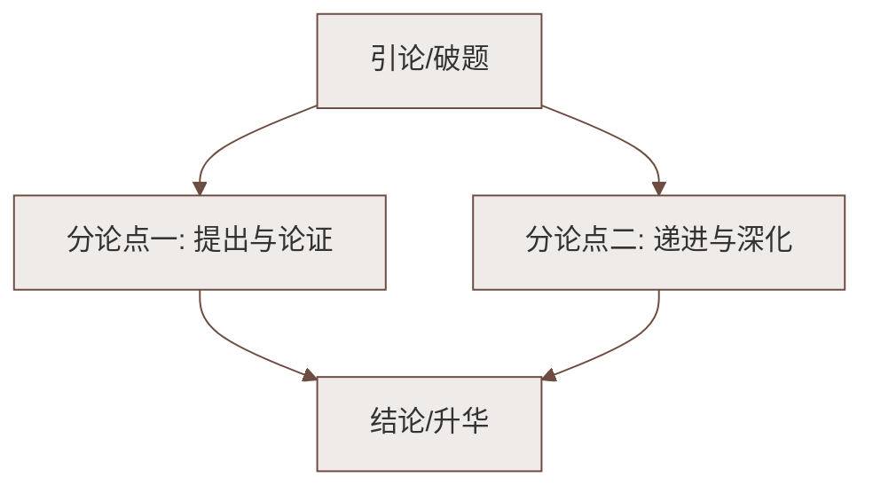

# 古文精读：《庄子》二则、《礼记》二则、马说

标签：#文言文 #古文精读 #中考必考

## 一、文学常识

- **庄子**（约前 369—前 286），名周，战国时期哲学家，**道家**学派代表人物，与老子并称"老庄"。《庄子》一书系庄子及其后学所著，善用寓言。二则为《北冥有鱼》（选自《逍遥游》）、《庄子与惠子游于濠梁之上》（选自《秋水》）。
- **《礼记》**，战国至秦汉间**儒家**论著汇编，相传由西汉**戴圣**编纂，又称《小戴礼记》。二则为《虽有嘉肴》（选自《学记》）、《大道之行也》（选自《礼运》）。
- **韩愈**（768—824），字退之，世称"韩昌黎"，唐代文学家，"唐宋八大家"之首，倡导古文运动。《马说》是一篇托物寓意的杂文。

## 二、课文要点

### 1. 北冥有鱼

鲲鹏形象：体大（"不知其几千里也"）、志高（"抟扶摇而上者九万里"）、有所待（须"海运""六月息"）。说明世间万物皆有所凭借，都不是绝对自由的，为"逍遥游"张本。想象雄奇，夸张恣肆。

### 2. 庄子与惠子游于濠梁之上

"鱼之乐"之辩：庄子由"出游从容"断定鱼乐（美学的、移情的眼光）；惠子以"子非鱼"相诘（逻辑的、认知的追问）；庄子"请循其本"机智反转。展现两位思想家的机辩与友情。

### 3. 虽有嘉肴

类比引入（嘉肴弗食不知其旨→至道弗学不知其善），层层推进得出中心论点：**"教学相长也"**——教与学互相促进。引用《兑命》"学学半"印证。

### 4. 大道之行也

阐述"大同"社会的纲领（天下为公，选贤与能，讲信修睦）与基本特征：人人得到关爱（老有所终，壮有所用，幼有所长）、人人安居乐业（男有分，女有归）、货尽其用、人尽其力，最终"外户而不闭"。

### 5. 马说

托物寓意：**千里马**喻人才，**伯乐**喻善于识别人才的人，**食马者**喻埋没摧残人才的统治者。中心句"其真不知马也"，抨击统治者不识人才、埋没人才，抒发怀才不遇的愤懑。三段分说"伯乐决定千里马命运→千里马被埋没的原因→食马者的愚妄"。

## 三、重点文言词语

| 词语 | 例句 | 释义 |
|---|---|---|
| 冥 | 北冥有鱼 | 同"溟"，海 |
| 抟 | 抟扶摇而上 | 盘旋飞翔 |
| 是 | 是鱼之乐也 | 这 |
| 循 | 请循其本 | 追溯 |
| 旨 | 不知其旨也 | 味美 |
| 困 | 然后能自强/知困 | 困惑 |
| 与 | 选贤与能 | 同"举"，推举 |
| 矜 | 矜、寡、孤、独 | 同"鳏"，老而无妻 |
| 骈 | 骈死于槽枥之间 | 本义两马并驾，引申为并列 |
| 食 | 食马者不知其能千里 | 同"饲"，喂 |
| 见 | 才美不外见 | 同"现"，表现 |
| 策 | 策之不以其道 | 用马鞭驱赶 |

## 四、重点句翻译

1. 鹏之徙于南冥也，水击三千里，抟扶摇而上者九万里。——鹏迁往南海时，翅膀拍击水面激起三千里的波涛，乘着旋风盘旋飞至九万里的高空。
2. 是故学然后知不足，教然后知困。——所以学习之后才知道自己的不足，教人之后才知道自己的困惑。
3. 且欲与常马等不可得，安求其能千里也？——想要跟普通的马一样尚且做不到，怎么能要求它日行千里呢？

## 五、主题思想

五篇短文思想各异：庄子的自由想象与审美情怀、《学记》的教育智慧、《礼运》的社会理想、韩愈的人才呼唤，共同构成先秦至唐代思想文化的精彩剖面。

## 六、练习题

1. 《北冥有鱼》中大鹏的形象有何特点？作者借它说明什么道理？
2. "教学相长"与《兑命》"学学半"的关系是什么？
3. 《马说》中"千里马""伯乐""食马者"各比喻什么？全文寄托了作者怎样的思想感情？

## 七、知识联系

- 同单元唐诗鉴赏见[[唐诗三首：石壕吏、茅屋为秋风所破歌、卖炭翁]]；
- "大同"理想可与[[古文精读：桃花源记、小石潭记、核舟记]]中的桃花源互相印证；
- 故事新编素材可用于[[写作：学写故事]]。

### 语文阅读与写作结构

