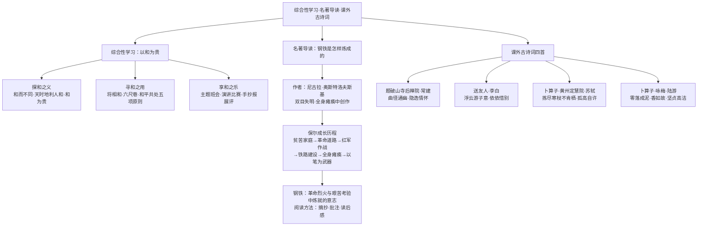

# 综合性学习、名著导读与课外古诗词诵读

标签：#综合性学习 #名著导读 #古诗词

## 一、综合性学习：以和为贵

### 1. 探"和"之义

- "和"是中华传统文化的核心理念之一："**和而不同**"（《论语》："君子和而不同，小人同而不和"）——承认差异，追求和谐，不盲目苟同；
- "**天时不如地利，地利不如人和**"（《孟子》）——"人和"是成事的关键；
- "和为贵"（《论语》："礼之用，和为贵"）——礼的作用以和谐为可贵。

### 2. 寻"和"之用

搜集体现"和"文化的事例：将相和、六尺巷（"让他三尺又何妨"）、和亲政策、和平共处五项原则等；联系班级生活，制定班级"和"文化公约。

### 3. 享"和"之乐

举办"以和为贵"主题班会、演讲比赛或手抄报展评。

## 二、名著导读：《钢铁是怎样炼成的》

### 1. 作品概况

作者**尼古拉·奥斯特洛夫斯基**（苏联），在双目失明、全身瘫痪的情况下创作了这部带有**自传性质**的小说。

### 2. 主人公保尔·柯察金的成长

发家：贫苦工人家庭→朱赫来引导走上革命道路→参加红军（骑兵）作战负伤→投身铁路建设（筑路是炼狱般的考验）→全身瘫痪、双目失明→以笔为武器创作《暴风雨所诞生的》。

### 3. 主题与名句

"钢铁"喻指**在革命烈火与艰苦考验中炼就的钢铁意志**。名段："人最宝贵的是生命……当他回首往事的时候，不因虚度年华而悔恨，也不因碌碌无为而羞愧。"

### 4. 阅读方法：摘抄和做笔记

摘抄精彩语句、写批注、做内容提要、写读后感，读写结合加深理解。

## 三、课外古诗词诵读（第六单元后）

| 篇目 | 作者 | 名句 | 主旨 |
|---|---|---|---|
| 题破山寺后禅院 | 常建 | 曲径通幽处，禅房花木深 | 寄情山水的隐逸情怀 |
| 送友人 | 李白 | 浮云游子意，落日故人情 | 依依惜别之情 |
| 卜算子·黄州定慧院寓居作 | 苏轼 | 拣尽寒枝不肯栖，寂寞沙洲冷 | 孤高自许、不随流俗 |
| 卜算子·咏梅 | 陆游 | 零落成泥碾作尘，只有香如故 | 坚贞不渝的高洁品格 |

## 四、练习题

1. 结合"和而不同"，谈谈如何处理与同学的意见分歧。
2. 保尔在筑路时经受了哪些考验？这段经历为什么最能体现"钢铁是怎样炼成的"？
3. 比较两首《卜算子》中"缺月挂疏桐"与"驿外断桥边"的意象与情感异同。
4. 默写：陆游《卜算子·咏梅》中表现梅花高洁的句子。

## 结构图解

## 五、知识联系

- "大同"社会与"和"文化一脉相承，见[[古文精读：《庄子》二则、《礼记》二则、马说]]；
- 第三单元名著《傅雷家书》见[[名著导读与课外古诗词诵读]]；
- 现实主义诗歌的家国情怀见[[唐诗三首：石壕吏、茅屋为秋风所破歌、卖炭翁]]。
