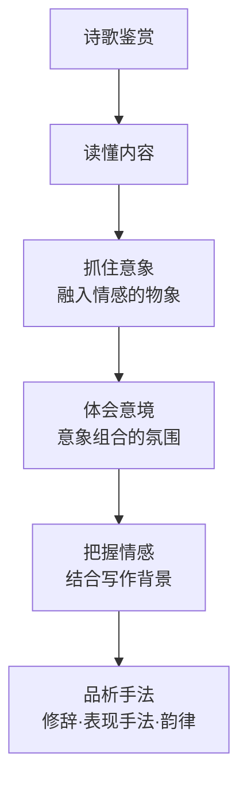

# 任务一 学习鉴赏

标签：#诗歌 #活动探究 #鉴赏方法

## 一、单元概述

九年级上册第一单元是"活动·探究"单元，以现代诗歌为学习对象，分为三个任务：学习鉴赏、诗歌朗诵、尝试创作。任务一要求自主阅读单元内六首诗歌，把握诗歌的意象、情感与艺术手法，为后续朗诵与创作打基础。

## 二、什么是诗歌鉴赏

诗歌鉴赏是通过品味语言、揣摩意象、体会情感，感受诗歌之美的阅读活动。核心步骤：**读懂内容—抓住意象—体会情感—品析手法**。

## 三、鉴赏的四个抓手

### 1. 意象

意象是融入了诗人主观情感的客观物象。如[[3 我爱这土地]]中的"土地""河流""风""黎明"，[[4 乡愁]]中的"邮票""船票""坟墓""海峡"。

### 2. 意境

意象组合形成的整体氛围与艺术境界。如[[1 沁园春·雪]]开篇"千里冰封，万里雪飘"营造壮阔雄浑的意境。

### 3. 情感

诗言志。要结合写作背景把握诗人情感，如[[2 周总理，你在哪里]]表达对总理深切的怀念。

### 4. 语言与手法

- 修辞：比喻、拟人、夸张、反复、设问；
- 表现手法：象征、对比、虚实结合、托物言志；
- 韵律：节奏、押韵、分行。

## 四、鉴赏示例

以[[5 你是人间的四月天——一句爱的赞颂]]为例：

1. 意象：四月天、云烟、星子、细雨、百花、新月；
2. 意境：轻盈、明媚、温暖；
3. 情感：对"爱、温暖与希望"的赞颂；
4. 手法：比喻连缀成篇，音韵和谐（"天""烟""前""圆"押韵）。

## 五、六首诗歌一览

| 诗歌 | 作者 | 核心意象 | 情感基调 |
| --- | --- | --- | --- |
| [[1 沁园春·雪]] | 毛泽东 | 北国雪景 | 豪迈自信 |
| [[2 周总理，你在哪里]] | 柯岩 | 高山、大地、森林 | 深情怀念 |
| [[3 我爱这土地]] | 艾青 | 土地、鸟 | 深沉挚爱 |
| [[4 乡愁]] | 余光中 | 邮票、海峡 | 惆怅思念 |
| [[5 你是人间的四月天——一句爱的赞颂]] | 林徽因 | 四月天 | 轻快赞美 |
| [[6 我看]] | 穆旦 | 春风、飞鸟 | 生命礼赞 |

## 六、练习题

1. 什么是意象？请从本单元任选一首诗，找出两个意象并分析其含义。
2. 比较[[3 我爱这土地]]与[[4 乡愁]]情感表达方式的异同。
3. 朗读[[1 沁园春·雪]]，说说词的上下阕在内容上有何分工。

## 七、复习建议

1. 建立"意象—情感"卡片，每首诗整理一张；
2. 完成鉴赏后进入[[任务二 诗歌朗诵]]，用声音传达理解；
3. 积累的手法可迁移到[[任务三 尝试创作]]。
