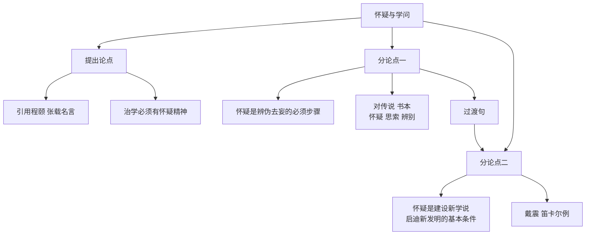

# 8 怀疑与学问

标签：#议论文 #顾颉刚 #中考高频

## 一、文学常识

- 作者：顾颉刚（1893—1980），江苏苏州人，历史学家，"古史辨"学派创始人，著有《古史辨》《汉代学术史略》等。
- 体裁：议论文（立论文）。文章论述治学必须有怀疑精神。

## 二、字词积累

- **譬如**（pì rú）：比如。
- **视察**：文中指察看、考察。
- **虚妄**（wàng）：没有事实根据的。
- **墨守**：固执拘泥，不会变通（源于墨子善守城，"墨守成规"）。
- **停滞**（zhì）：因受阻碍不能顺利地运动或发展。
- **不攻自破**：不用攻击，自己就溃败了，形容论点站不住脚。
- **尽信书则不如无书**：语出《孟子》，读书要有怀疑批判精神。

## 三、结构层次

1. 提出论点（第1—2段）：引用程颐"学者先要会疑"、张载"在可疑而不疑者，不曾学；学则须疑"两句名言，提出中心论点——**治学必须有怀疑精神**；
2. 分论点一（第3—5段）：怀疑是消极方面辨伪去妄的必须步骤——对传说、书本都要经过"怀疑、思索、辨别"三步；
3. 分论点二（第6段）：怀疑是积极方面建设新学说、启迪新发明的基本条件——以戴震、笛卡尔为例。

过渡句："怀疑不仅是消极方面辨伪去妄的必须步骤，也是积极方面建设新学说、启迪新发明的基本条件。"（承上启下，是两个分论点的联结）

## 四、论证方法

1. **引用论证**：引程颐、张载、孟子、笛卡尔名言，增强说服力；
2. **举例论证**："三皇五帝""腐草为萤"的传说需考证；戴震幼年读《大学章句》善疑；
3. **对比论证**："因怀疑而思索……否则便是盲从，便是迷信"，正反对照。

## 五、段落赏析

1. 开篇引用两句古代学者名言作论点提出方式，既是论点又是论据，简洁有力。
2. "怀疑、思索、辨别"三步：揭示怀疑精神的内涵与运用程序，逻辑严密，不可颠倒。
3. 第6段"一切学问家……要这样才能有更新更善的学说产生"：四个"常常"组成排比，层层递进，概括学问家治学的常态。

## 六、主题思想

文章论述了"治学必须有怀疑精神"的观点，强调怀疑既是辨伪去妄的必须步骤，又是建设新学说的基本条件，勉励人们在学习中养成怀疑精神，不盲从、不迷信。

## 七、写作特色

1. 论点提出巧妙（引名言开篇）；
2. 层进式结构，过渡句衔接自然；
3. 论证方法多样，逻辑严密；
4. 语言准确，如"一切""常常"等词分寸恰当。

## 八、练习题

1. 本文的中心论点和两个分论点分别是什么？
2. 找出文中的过渡句并分析其作用。
3. 第6段运用了哪些论证方法？举例说明。
4. "怀疑""思索""辨别"三步能否调换顺序？为什么？

## 九、知识联系

- 与[[7 想和做]]同为治学议论文，可比较论证结构；
- 与[[20 中国人失掉自信力了吗]]的驳论方式形成对照；
- 观点表述技巧见[[写作：观点要明确]]。
