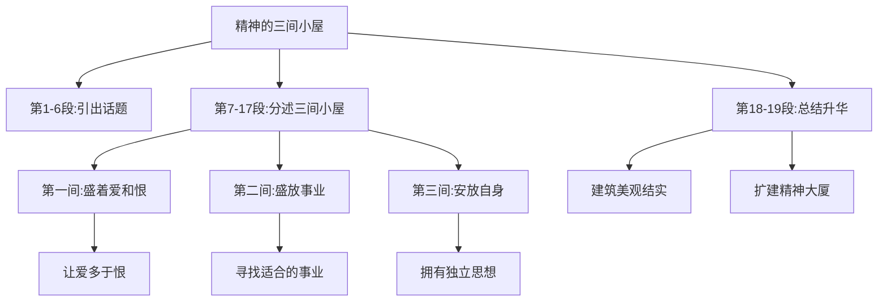

# 10* 精神的三间小屋

标签：#议论性散文 #毕淑敏 #自读课文

## 一、文学常识

- 作者：毕淑敏，1952年生，当代作家、心理学家，曾从军当军医多年，代表作《红处方》《血玲珑》《拯救乳房》，散文集《提醒幸福》等。
- 体裁：议论性散文。以"三间小屋"为喻，论述精神世界的建构。

## 二、字词积累

- **广袤**（mào）：土地的面积，东西为广，南北为袤，泛指辽阔。
- **积攒**（zǎn）：一点一点地聚集。
- **宽宥**（yòu）：宽恕，原谅。
- **游弋**（yì）：（船只）巡逻，文中指来回浮动。
- **困厄**（è）：（处境）艰难窘迫。
- **濡养**（rú）：滋养。
- **麾下**（huī）：将旗之下，指部下。
- **嘟囔**（dū nang）：连续不断地自言自语。
- **灰烬**（jìn）：物品燃烧后的灰和烧剩下的东西。
- **自惭形秽**（huì）：原指因自己容貌举止不如别人而感到惭愧，泛指自愧不如。
- **间不容发**（jiān bù róng fà）：两物中间容不下一根头发，形容事物之间距离极小或情势极其危急。
- **金戈铁马**：指战争，也形容雄壮的军旅生涯。
- **形销骨立**：形容身体极其消瘦。
- **鸠占鹊巢**（jiū）：比喻强占别人的住处或位置。
- **李代桃僵**（jiāng）：比喻以此代彼或代人受过。

## 三、结构层次

1. 第1—6段：引出话题——由"身安"引向"心安"，人的心灵需要空间，提出为精神修建三间小屋；
2. 第7—17段：分述三间小屋：
   - 第一间：盛着我们的**爱和恨**——让爱多于恨，小屋才光明温暖；
   - 第二间：盛放我们的**事业**——寻找适合自己的事业，让小屋坚固优雅；
   - 第三间：安放我们**自身**——拥有独立的思想，不迷失自我；
3. 第18—19段：总结——把小屋建筑得美观结实，进而扩建"精神大厦"。

## 四、段落赏析

1. "假若爱比恨多，小屋就光明温暖……"：对比与假设并用，形象说明心灵底色由自己调配，应"给爱留下足够的容量"。
2. "否则，鸠占鹊巢，李代桃僵"：连用成语，指出事业错位对精神小屋的侵蚀，警策凝练。
3. "我们把自己的头脑，变成他人思想的跑马场"：比喻辛辣，批评丧失独立思考、人云亦云的精神状态。

## 五、主题思想

文章以"三间小屋"为喻，阐述了如何建构个人精神世界：让爱充盈心灵，让事业滋养人生，让自我思想独立，启示人们关注精神生活，建设健康而丰盈的心灵空间。

## 六、写作特色

1. 比喻新颖贴切，"小屋"贯穿全篇，说理形象化；
2. 议论与抒情结合，语言细腻典雅；
3. 成语与整句大量运用，文气充沛。

## 七、练习题

1. "三间小屋"分别盛放什么？作者对每间小屋提出了怎样的要求？
2. 赏析"把自己的头脑，变成他人思想的跑马场"。
3. 本文作为议论性散文，与规范议论文（如[[8 怀疑与学问]]）在表达上有何不同？
4. 结合自身，谈谈你打算如何布置自己的"精神小屋"。

## 八、知识联系

- 与[[7 想和做]][[8 怀疑与学问]]同单元，可比较"形象说理"与"逻辑说理"；
- 修身立己的话题可联系[[综合性学习：君子自强不息]]。
