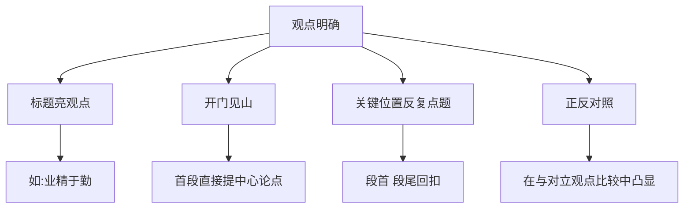

# 写作：观点要明确

标签：#写作 #议论文 #观点

## 一、写作目标

学习议论文写作的第一要义：**观点明确**。观点是议论文的灵魂，要让读者一眼看出你主张什么、反对什么。

## 二、什么是观点明确

1. **态度明朗**：赞成还是反对，肯定还是否定，不含糊、不骑墙；
2. **表述清晰**：用简洁的判断句表述，如"治学必须有怀疑精神"（[[8 怀疑与学问]]）；
3. **概念确定**：关键词内涵前后一致，不偷换概念；
4. **全文统一**：所有材料、论证都围绕中心观点展开。

## 三、观点表述的常见问题

| 问题 | 示例 | 修改 |
| --- | --- | --- |
| 模棱两可 | "网络游戏有好处也有坏处" | "中学生应节制网络游戏" |
| 表述含混 | "我们要正确对待挫折" | "挫折是成长的磨刀石" |
| 范围过大 | "读书很重要" | "经典阅读能滋养精神底气" |
| 前后不一 | 开头谈"勤奋"结尾谈"天赋" | 统一于"勤奋成就人生" |

## 四、让观点明确的方法

1. **标题亮观点**：如"业精于勤""宽容是金"；
2. **开门见山**：首段直接提出中心论点，如[[7 想和做]]先摆现象再迅速立论；
3. **关键位置反复点题**：段首句、结尾回扣论点；
4. **正反对照**：在与对立观点的比较中凸显自己的主张，如[[9* 就英法联军远征中国致巴特勒上尉的信]]在赞美与谴责的反差中立场分明。

## 五、写作实践（教材题目）

1. 以"知足与快乐"为话题，确定观点，写一段议论性文字（200字左右）；
2. 以《谈诚信》为题写一篇议论文，观点明确，不少于600字；
3. 针对"网上阅读能否取代纸质阅读"的讨论，确立自己的看法并阐述理由。

## 六、例文提纲示例

题目：《谈诚信》

- 中心论点：诚信是立身之本；
- 分论点一：诚信赢得他人信任（例：商鞅立木）；
- 分论点二：失信毁掉个人前程（例：周幽王烽火戏诸侯）；
- 分论点三：诚信更是社会良性运转的基石；
- 结尾：回扣论点，发出倡议。

## 七、常见误区提醒

1. 论点写成疑问句或现象描述；
2. 一篇文章出现两个并列且无主次的中心；
3. 论据堆砌却不点明与观点的关系。

## 八、知识联系

- 观点确立后，材料支撑见[[写作：议论要言之有据]]；
- 论证推进的逻辑见[[写作：论证要合理]]；
- 课文示范：[[7 想和做]][[8 怀疑与学问]]。
