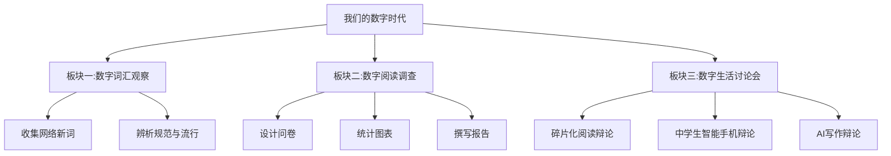

# 综合性学习：我们的数字时代

标签：#综合性学习 #数字生活 #语文实践

## 一、活动概述

本次综合性学习围绕"数字时代的语文生活"展开，引导同学们观察数字技术对语言、阅读、交往方式的影响，学会理性使用数字媒介，做数字时代合格的表达者与思考者。

## 二、活动板块

### 板块一：数字词汇观察

1. 收集网络新词语（如"点赞""刷屏""云课堂""数字人"），分类整理；
2. 辨析哪些词已进入规范词典，哪些仅是一时流行；
3. 讨论：网络语言丰富了还是污染了汉语？

### 板块二：数字阅读调查

1. 设计问卷：同学们每天数字阅读与纸质阅读的时长、内容、感受；
2. 统计数据并制作图表；
3. 撰写调查报告，观点要明确（方法参见[[写作：观点要明确]]）。

### 板块三：数字生活讨论会

围绕以下辩题展开讨论或辩论：

- 碎片化阅读利大于弊还是弊大于利？
- 中学生应不应该拥有自己的智能手机？
- 人工智能写作会取代人的写作吗？

## 三、活动方法指导

1. **收集资料**：善用搜索引擎与图书馆，注意核实信息来源的可靠性；
2. **辨别信息**：警惕网络谣言，做到"怀疑—思索—辨别"（参考[[8 怀疑与学问]]的治学方法）；
3. **理性表达**：网上发言有观点、有依据、有礼貌，不跟风、不网暴；
4. **成果呈现**：可用调查报告、演讲、手抄报、短视频脚本等形式。

## 四、知识卡片：数字时代的媒介素养

1. 信息素养：会检索、会筛选、会判断真伪；
2. 表达素养：负责任地发布信息，尊重版权；
3. 安全素养：保护个人隐私，防范网络诈骗；
4. 时间管理：防止沉迷，平衡线上线下生活。

## 五、示例：调查报告提纲

题目：《本班同学数字阅读现状调查报告》

1. 调查目的与方法（问卷40份，访谈5人）；
2. 现状数据：日均数字阅读约90分钟，以短视频与公众号为主；
3. 问题分析：碎片化、浅表化，深度阅读时间不足；
4. 建议：设立"无屏幕阅读时段"，师生共读整本书（可结合[[整本书阅读：《简·爱》]]）。

## 六、实践任务

1. 完成一份数字生活小调查并形成报告；
2. 以"我看人工智能写作"为题作3分钟演讲；
3. 制作"文明上网公约"班级海报。

## 七、复习建议

1. 积累活动中出现的新词语与规范表达；
2. 调查报告写作注意数据与观点的对应，观点表述参考[[写作：观点要明确]]；
3. 讨论中练习有理有据的表达，为[[写作：议论要言之有据]]做准备。
