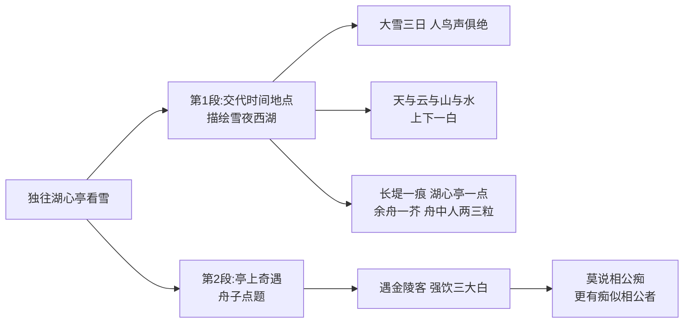

# 13* 湖心亭看雪

标签：#文言文 #张岱 #白描

## 一、文学常识

- 作者：张岱（1597—1689？），字宗子，号陶庵，明末清初文学家，著有《陶庵梦忆》《西湖梦寻》。本文选自《陶庵梦忆》。
- 背景：明亡后张岱入山著书，追忆前尘往事。文中"崇祯五年"用明朝年号，寄寓故国之思。

## 二、字词积累

- **更定**（gēng）：晚上八时左右。旧时一夜分五更，更定指初更以后。
- **拏**（ná）：撑（船）。
- **拥毳衣炉火**（cuì）：裹着裘皮衣服，围着火炉。毳，鸟兽的细毛。
- **雾凇沆砀**（sōng hàng dàng）：冰花周围弥漫着白汽。
- **长堤一痕**：西湖长堤在雪中只隐隐露出一道痕迹。
- **芥**（jiè）：小草，比喻轻微纤细的事物。
- **毡**（zhān）：毡子。
- **强饮**（qiǎng）：尽力地喝。
- **客此**：客居此地。
- **舟子**：船夫。
- **喃喃**：小声地不断念叨。

## 三、结构层次

1. 第1段：交代时间（崇祯五年十二月，大雪三日）、地点与独往湖心亭看雪的行踪，描绘雪夜西湖的空阔之景；
2. 第2段：亭上奇遇——金陵客对饮，"强饮三大白而别"，借舟子之口以"痴"字收束。

## 四、段落赏析

1. "大雪三日，湖中人鸟声俱绝"：一个"绝"字从听觉落笔，写出雪后西湖万籁俱寂的森然寒意，为"独往"作铺垫。
2. "雾凇沆砀，天与云与山与水，上下一白"：连用三个"与"，天地混茫一片，营造阔大空灵的意境。
3. "湖上影子，惟长堤一痕、湖心亭一点、与余舟一芥、舟中人两三粒而已"：**白描**典范。"痕、点、芥、粒"量词递减，以微衬阔，人在天地间渺如一粟，蕴含深沉的人生感慨。
4. "莫说相公痴，更有痴似相公者"："痴"是全文点睛——痴迷于天人合一的山水之乐，痴迷于世俗之外的雅情雅致，也暗含遗世独立的故国之思。

## 五、主题思想

文章以清淡笔墨记述雪夜独往湖心亭看雪的经历，描绘了幽静空灵的雪景，表现了作者遗世独立、卓然不群的高雅情趣，流露出淡淡的故国之思与人生渺茫的感慨。

## 六、写作特色

1. **白描手法**：寥寥数笔，不加渲染，神韵全出；
2. 叙事、写景、抒情浑然一体；
3. 量词妙用，以小见大；
4. 语言简练含蓄，"痴"字余味悠长。

## 七、练习题

1. 解释：更定、拏、雾凇沆砀、强饮、客此。
2. "独往湖心亭看雪"的"独"字表现了作者怎样的情怀？
3. 赏析"惟长堤一痕、湖心亭一点、与余舟一芥、舟中人两三粒而已"。
4. 文章开头用"崇祯五年"纪年有什么深意？

## 八、知识联系

- 白描与[[12 醉翁亭记]]的渲染铺陈形成鲜明对照；
- 与[[11 岳阳楼记]]同写湖景，境界一阔大昂扬、一空灵孤寂；
- 雪景描写可回看[[1 沁园春·雪]]，比较古今写雪的不同气象。
