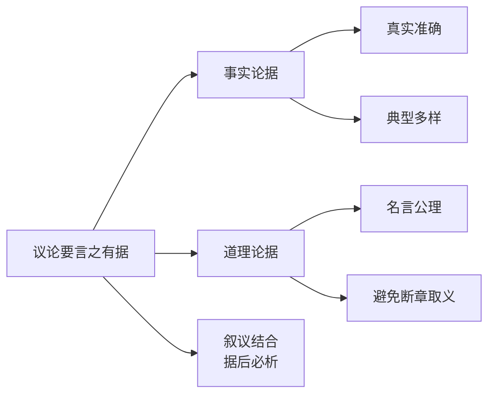

# 写作：议论要言之有据

标签：#写作 #议论文 #论据

## 一、写作目标

学习为观点提供**真实、恰当、充分**的论据，做到言之有据、以据服人。

## 二、论据的两大类型

### 1. 事实论据

有代表性的事例、史实、统计数据。如[[8 怀疑与学问]]中戴震幼年善疑的事例。

### 2. 道理论据

经过验证的真理、名言警句、公理格言。如[[8 怀疑与学问]]开篇引程颐、张载之言。

## 三、使用论据的三条要求

### 1. 材料要真实准确

- 事例不可虚构、张冠李戴；名言出处、原文要核实；
- 数据注明来源，避免"据说""大概"。

### 2. 材料要与观点一致

- 论据必须能支撑论点，防止"材料与观点两张皮"；
- 引用要忠于原意，不断章取义。

### 3. 材料要典型多样

- 优先选公认的、有代表性的材料；
- 古今中外搭配，事实与道理搭配，增强说服力。

## 四、论据的呈现技巧

1. **概述式引用**：事例只取与论点相关的要点，忌大段叙述；
2. **引后分析**：摆出论据后须有分析，点明"据"如何证明"点"——常用"可见""正因为……才……"衔接；
3. **正反并举**：正面例与反面例对照，如[[7 想和做]]中空想者与死做者的对照。

## 五、常见毛病诊断

| 毛病 | 表现 | 对策 |
| --- | --- | --- |
| 以叙代议 | 例子讲成故事 | 压缩叙述，加强分析 |
| 论据陈旧 | 千篇一律爱迪生、司马迁 | 积累新鲜时代素材 |
| 论据失真 | 编造名人名言 | 查证出处 |
| 据点脱节 | 例子与论点无关 | 写"分析句"检验关联 |

## 六、素材积累建议

1. 分主题建立素材本：勤奋、诚信、创新、家国、自强（可结合[[综合性学习：君子自强不息]]）；
2. 从课文中取材：如[[11 岳阳楼记]]范仲淹先忧后乐、[[14 诗词三首]]苏轼旷达；
3. 关注时事人物与数据，注明来源。

## 七、写作实践（教材题目）

1. 为"知足常乐"或"知不足者常乐"寻找两个事实论据和一个道理论据，写一段议论文字；
2. 以《谈自立》为题写一篇议论文，至少使用两类论据，不少于600字；
3. 检查自己上次作文，替换一个不够典型的论据。

## 八、知识联系

- 先立观点再找论据，见[[写作：观点要明确]]；
- 论据与论点之间的推理见[[写作：论证要合理]]；
- 课文示范：[[8 怀疑与学问]][[20 中国人失掉自信力了吗]]。
