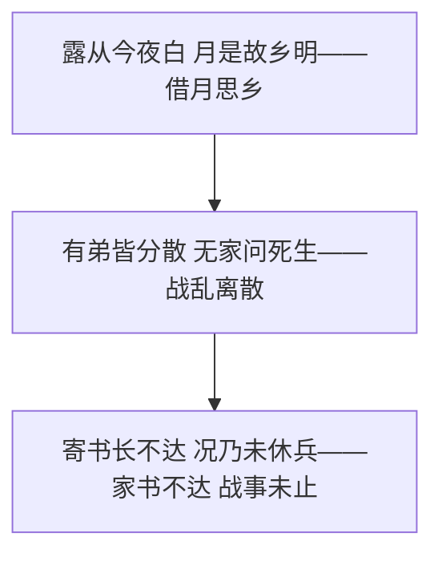
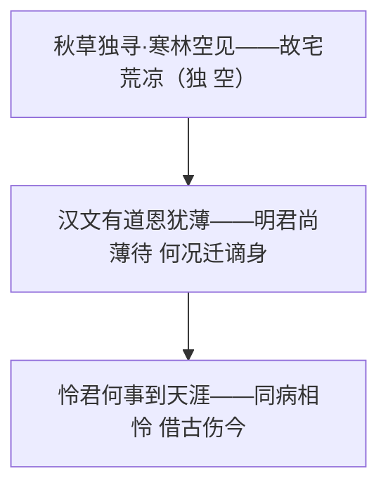
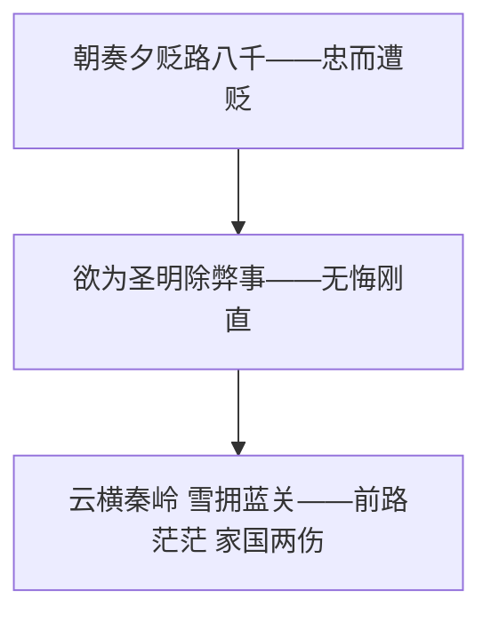

# 课外古诗词诵读

标签：#古诗词 #课外诵读 #唐诗

## 一、篇目总览

第三单元课外古诗词共四首：杜甫《月夜忆舍弟》、刘长卿《长沙过贾谊宅》、韩愈《左迁至蓝关示侄孙湘》、温庭筠《商山早行》。四首均与漂泊、贬谪、思乡相关。

## 二、月夜忆舍弟·杜甫

- 作者：杜甫（712—770），字子美，自号少陵野老，"诗圣"，其诗称"诗史"。
- 背景：乾元二年（759）秋，安史之乱中，诸弟离散，杳无音信。
- 名句："**露从今夜白，月是故乡明**"——移情于景，同一轮明月，偏觉故乡的更明，写尽思乡怀人之情。
- "有弟皆分散，无家问死生"：战乱中骨肉离散的悲痛，"寄书长不达"呼应"未休兵"。
- 主题：怀念弟弟，思念故乡，忧虑战乱。

## 三、长沙过贾谊宅·刘长卿

- 作者：刘长卿（约726—约786），字文房，唐代诗人，自称"五言长城"。
- 背景：诗人两遭迁谪，途经长沙贾谊故宅，借凭吊贾谊抒自身迁谪之感。
- 名句："**秋草独寻人去后，寒林空见日斜时**"——"独""空"二字渲染故宅荒凉冷落，寄寓物是人非之悲。
- "汉文有道恩犹薄"：明君尚且薄待贾谊，暗讽当朝，含蓄深沉。
- 主题：借古伤今，抒发怀才不遇、迁谪失意的悲愤。

## 四、左迁至蓝关示侄孙湘·韩愈

- 作者：韩愈（768—824），字退之，世称韩昌黎，"唐宋八大家"之首。
- 背景：元和十四年（819），韩愈因谏迎佛骨触怒宪宗，由刑部侍郎贬为潮州刺史，途中示侄孙韩湘。
- 名句："**云横秦岭家何在？雪拥蓝关马不前**"——云横雪拥，既是眼前实景，又象征仕途险恶；顾瞻家国、前路茫茫之情尽在其中。
- "欲为圣明除弊事，肯将衰朽惜残年"：直言忠而获罪，仍无怨无悔，刚直之气凛然。
- 主题：抒写忠而被贬的悲愤，表现刚正不屈的气节。

## 五、商山早行·温庭筠

- 作者：温庭筠（约801—866），本名岐，字飞卿，晚唐诗人、词人，"花间词派"鼻祖。
- 名句："**鸡声茅店月，人迹板桥霜**"——纯用名词意象排列（鸡声、茅店、月、人迹、板桥、霜），不着一个动词，绘出早行图景，为"意象叠加"千古名例。
- "因思杜陵梦，凫雁满回塘"：以梦中故乡春景反衬旅途的清冷孤寂。
- 主题：写羁旅早行之苦，抒发游子思乡之情。

## 六、四首比较

| 篇目 | 作者 | 情感核心 | 手法亮点 |
| --- | --- | --- | --- |
| 月夜忆舍弟 | 杜甫 | 忆弟思乡 | 移情于景 |
| 长沙过贾谊宅 | 刘长卿 | 迁谪之悲 | 借古伤今 |
| 左迁至蓝关示侄孙湘 | 韩愈 | 忠而被贬 | 即景抒情 |
| 商山早行 | 温庭筠 | 羁旅乡思 | 意象叠加 |

## 七、练习题

1. 默写四首诗中的名句。
2. 赏析"月是故乡明"的"明"字。
3. "鸡声茅店月，人迹板桥霜"在写法上有何独特之处？
4. 韩愈与刘长卿同写贬谪，情感基调有何不同？

## 八、知识联系

- 贬谪主题可联系[[14 诗词三首]]中刘禹锡、苏轼的旷达；
- 意象分析方法同[[任务一 学习鉴赏]]；
- 更多古诗积累见[[整本书阅读：《唐诗三百首》]]。
