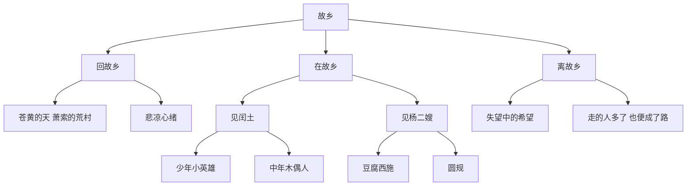
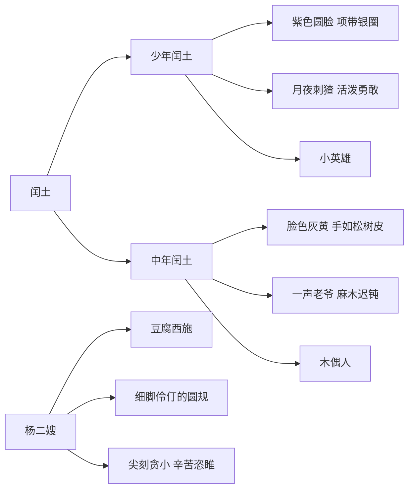

# 15 故乡

标签：#小说 #鲁迅 #中考高频

## 一、文学常识

- 作者：鲁迅（1881—1936），原名周树人，浙江绍兴人，文学家、思想家、革命家。本文选自小说集《呐喊》。
- 背景：1919年12月，鲁迅回绍兴老家搬家北上，目睹辛亥革命后农村的凋敝与农民的困苦，1921年写成此篇。
- 体裁：短篇小说。"我"是叙述者，有作者的影子但不等于作者。

## 二、字词积累

- **阴晦**（huì）：阴沉昏暗。
- **萧索**（xiāo suǒ）：荒凉、冷落。
- **祭祀**（jì sì）：旧俗备供品向神佛或祖先行礼。
- **伶俐**（líng lì）：聪明、灵活。
- **愕然**（è）：吃惊的样子。
- **鄙夷**（bǐ yí）：看不起。
- **嗤笑**（chī）：讥笑。
- **瑟索**（sè suǒ）：身体因寒冷、受惊而蜷缩或抖动。
- **惘然**（wǎng）：心里好像失去了什么的样子。
- **隔膜**（gé mó）：彼此思想感情不相通。
- **恣睢**（zì suī）：放纵、放任。

## 三、结构层次

以"我"回故乡的见闻感受为线索：

1. **回故乡**（1—5段）：渐近故乡，萧索之景触发悲凉心绪；
2. **在故乡**（6—77段）：见闰土、杨二嫂，感受人的巨变——小说主体；
3. **离故乡**（78—88段）：坐船离去，抒发对新生活的期望，"路"的议论收束。

## 四、人物形象

### 闰土（对比刻画）

- 少年闰土：紫色圆脸、项带银圈，月夜刺猹，活泼勇敢、见多识广的小英雄；
- 中年闰土：脸色灰黄、皱纹深刻、手如松树皮，一声"老爷"、一副香炉，麻木迟钝、被封建等级观念束缚的木偶人；
- 变化原因："多子，饥荒，苛税，兵，匪，官，绅"——帝国主义与封建主义的双重压迫。

### 杨二嫂

昔日"豆腐西施"，今日"细脚伶仃的圆规"，尖刻贪小、辛苦恣睢，是被生活挤压变形的小市民形象，衬托农村经济的全面破产。

## 五、段落赏析

1. 开头景物："苍黄的天底下，远近横着几个萧索的荒村，没有一些活气"——"横"字写出死气沉沉，奠定全文悲凉基调。
2. "我"记忆中的月夜瓜地："深蓝的天空中挂着一轮金黄的圆月……"——色彩明丽，与现实之灰暗形成强烈对比。
3. 结尾："希望是本无所谓有，无所谓无的。这正如地上的路；其实地上本没有路，走的人多了，也便成了路。"——以"路"喻希望，说明新生活要靠人们共同奋斗去开创，是全文思想的升华。

## 六、主题思想

小说通过"我"回故乡的见闻，描绘了辛亥革命后中国农村衰败的图景，通过闰土前后的巨变，揭示了封建等级观念和多重压迫对农民精神的戕害，表达了作者改造旧社会、创造新生活的强烈愿望。

## 七、写作特色

1. 对比手法贯穿全篇（景、人、情的今昔对比）；
2. 白描与细节刻画传神（"老爷"一词、圆规姿态）；
3. 景物描写烘托心境；
4. 结尾议论含蓄深刻。

## 八、练习题

1. 小说以什么为线索？分为哪三部分？
2. 从外貌、语言、动作分析闰土前后的变化及原因。
3. 杨二嫂形象在小说中的作用是什么？
4. 谈谈你对"走的人多了，也便成了路"的理解。

## 九、知识联系

- 与[[16 我的叔叔于勒]]同为写人情变化的小说，可比较主题与手法；
- 鲁迅杂文的批判锋芒见[[20 中国人失掉自信力了吗]]；
- 小说阅读方法可迁移到[[17* 孤独之旅]][[18* 蒲柳人家（节选）]]。
