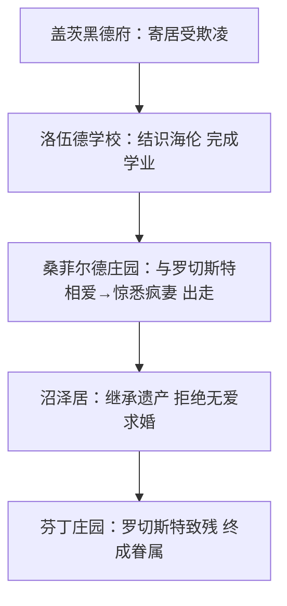

# 整本书阅读：《简·爱》

标签：#名著阅读 #夏洛蒂·勃朗特 #外国小说

## 一、作品概况

- 作者：夏洛蒂·勃朗特（1816—1855），19世纪英国女作家，与妹妹艾米莉（《呼啸山庄》）、安妮并称"勃朗特三姐妹"。
- 《简·爱》1847年出版，带有浓厚自传色彩，是一部以第一人称叙述的成长小说，被誉为英国文学史上"一部有着永久魅力的经典"。

## 二、主要情节（五个人生阶段）

1. **盖茨黑德府**：孤女简·爱寄居舅妈里德太太家，备受欺凌，反抗表哥约翰后被关"红房子"，后被送往孤儿院；
2. **洛伍德学校**：条件恶劣，遭布罗克赫斯特羞辱；结识挚友海伦·彭斯与谭波尔小姐，完成学业并留校任教两年；
3. **桑菲尔德庄园**：应聘家庭教师，与主人罗切斯特相爱；婚礼上惊悉罗切斯特有疯妻伯莎藏于阁楼，简毅然出走；
4. **沼泽居（圣约翰家）**：沿途乞讨几乎丧命，被牧师圣约翰兄妹收留，意外继承叔父遗产并发现表亲关系；拒绝圣约翰无爱的求婚；
5. **芬丁庄园**：疯妻纵火烧毁庄园身亡，罗切斯特致残失明；简回到他身边，有情人终成眷属。

## 三、人物形象

- **简·爱**：相貌平凡而心灵丰盈，自尊自爱、独立坚强、追求平等与尊严。名言："我们的精神是平等的，就如同你跟我经过坟墓，将同样地站在上帝面前。"
- **罗切斯特**：桑菲尔德庄园主人，性格阴郁多变而热情真挚，敢于蔑视世俗，最终在磨难中获得救赎；
- **海伦·彭斯**：简在洛伍德的挚友，宽容坚忍，信仰虔诚，早逝，给予简精神影响；
- **圣约翰**：冷峻克己的传教士，把婚姻当作事业工具，反衬简对真爱的坚持；
- **伯莎·梅森**：阁楼上的疯女人，罗切斯特的合法妻子，是情节转折的关键。

## 四、主题思想

1. 女性的独立与尊严：简·爱始终坚持人格平等，"贫穷、低微、不美、矮小"都不能剥夺灵魂的平等；
2. 爱情观：真正的爱情建立在精神平等与相互尊重之上，而非金钱地位；
3. 反抗精神：对压迫、虚伪与不公的不屈抗争；
4. 成长与救赎：苦难磨砺人格，宽恕带来新生。

## 五、艺术特色

1. 第一人称叙述，心理描写细腻真挚；
2. 浓郁的抒情笔调与哥特式神秘色彩（红房子、阁楼疯女人、夜半怪笑）结合；
3. 环境描写与人物命运呼应（荒原、风暴、被雷劈的七叶树）。

## 六、阅读方法指导（外国小说阅读）

1. 关注叙述视角："我"的叙述拉近读者距离，注意区分叙述者与作者；
2. 梳理成长线索：按五个地点画出简·爱的人生轨迹图；
3. 做摘抄与批注：积累精彩的心理描写与经典对白；
4. 联系文化背景：了解19世纪英国的等级制度与女性处境。

## 七、练习题

1. 按顺序说出简·爱人生的五个阶段及各阶段的关键事件。
2. 简·爱为什么在婚礼后毅然离开罗切斯特？这体现了她怎样的性格？
3. 简·爱为什么拒绝圣约翰的求婚？
4. 结合具体情节，谈谈你对"精神平等"的理解。

## 八、知识联系

- 成长主题可与[[17* 孤独之旅]]的杜小康对照——中外少年的不同成长之路；
- 自强不息的品格呼应[[综合性学习：君子自强不息]]；
- 阅读整本书的方法同样适用于[[整本书阅读：《唐诗三百首》]]。
