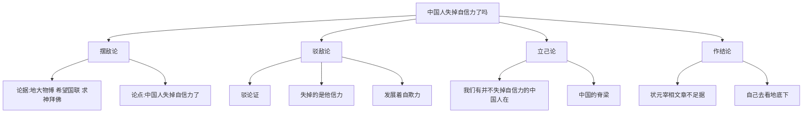

# 20 中国人失掉自信力了吗

标签：#驳论文 #鲁迅 #中考高频

## 一、文学常识

- 作者：鲁迅（1881—1936），本文选自杂文集《且介亭杂文》。
- 背景：1934年，"九一八"事变三周年之际，国民党政府多次向国联申诉无果，又有人求神拜佛，悲观论调弥漫，有人慨叹"中国人失掉自信力了"。鲁迅写此文予以驳斥。
- 体裁：**驳论文**。本文是初中阶段学习驳论的典范篇目。

## 二、字词积累

- **玄虚**（xuán）：空而不切实，不可信。
- **渺茫**（miǎo）：因遥远而模糊不清；因没有把握而难以预期。
- **麻醉**：文中比喻用某种手段使人认识模糊、意志消沉。
- **摧残**（cuī cán）：使（身体、精神等）蒙受严重损失。
- **诓骗**（kuāng）：说谎话骗人。
- **怀古伤今**：追念古代的事情，感伤现在的事情。
- **埋头苦干**、**拼命硬干**、**为民请命**、**舍身求法**：四类"中国的脊梁"的行为特征。
- **自欺欺人**：欺骗自己，也欺骗别人。
- **前仆后继**（pū）：前面的人倒下了，后面的人继续跟上去，形容英勇奋斗，不怕牺牲。

## 三、结构层次（驳论思路）

1. **摆敌论**（1—2段）：摆出对方论据（自夸"地大物博"—希望国联—求神拜佛）与论点（中国人失掉自信力了）；
2. **驳敌论**（3—5段）：**驳论证**——论据只能证明失掉的是"他信力"、发展着"自欺力"，推不出"失掉自信力"的结论；
3. **立己论**（6—8段）：正面提出"我们有并不失掉自信力的中国人在"，列举"中国的脊梁"——埋头苦干的人、拼命硬干的人、为民请命的人、舍身求法的人；
4. **作结论**（9段）："自信力的有无，状元宰相的文章是不足为据的，要自己去看地底下。"

## 四、段落赏析

1. "他信力""自欺力"：仿拟"自信力"临时造词，既一针见血又辛辣讽刺，是鲁迅杂文语言的独创。
2. "我们从古以来，就有埋头苦干的人……这就是中国的脊梁"：排比列举四类人，热情礼赞历史上前仆后继的民族中坚，"脊梁"的比喻庄严有力。
3. "状元宰相的文章不足为据，要自己去看地底下"："状元宰相"指为统治者粉饰的御用文人，"地底下"指当时处于地下斗争状态的革命力量，结尾含蓄而坚定。

## 五、主题思想

文章驳斥了"中国人失掉自信力了"的悲观论调，指出所谓"失掉自信力"者只是失掉"他信力"、发展"自欺力"的一部分人，热情歌颂了作为"中国的脊梁"的广大人民，激发了民族自信心。

## 六、写作特色

1. 驳立结合：先驳论证之谬，再立正面论点；
2. 尖锐泼辣的讽刺语言（仿词、反语）；
3. 逻辑严密："中国人"一词内涵随语境变化，指代精准。

## 七、练习题

1. 对方的论点、论据分别是什么？作者是从驳论点还是驳论证入手的？
2. "他信力""自欺力"的表达效果是什么？
3. "中国的脊梁"指哪四类人？请各举一个历史人物。
4. 文中几个"中国人"的含义分别是什么？

## 八、知识联系

- 与[[21* 谈骨气]]同颂民族气节，一驳一立，可对比阅读；
- 立论方法参考[[8 怀疑与学问]]；
- 驳论技巧可用于[[写作：论证要合理]]中"反驳"的练习；
- 鲁迅小说笔法见[[15 故乡]]。
