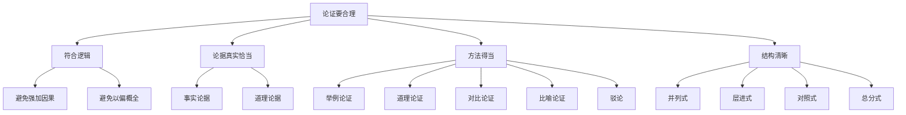

# 写作：论证要合理

标签：#写作 #议论文 #论证

## 一、写作目标

在观点明确、言之有据的基础上，学习使论证过程**符合逻辑、方法得当、结构清晰**。

## 二、论证合理的四条要求

### 1. 论证要符合逻辑

- 观点与材料之间要有必然联系，推理站得住脚；
- 避免"强加因果""以偏概全""偷换概念"等逻辑谬误；
- 例：由"一次考试失利"推出"永远学不好数学"，就是以偏概全。

### 2. 使用论据要保证真实、恰当

论据本身可靠，且确实能推出论点（详见[[写作：议论要言之有据]]）。

### 3. 选择恰当的论证方法

- **举例论证**：摆事实，如[[21* 谈骨气]]三例证三层内涵；
- **道理论证**：讲道理、引名言，如[[8 怀疑与学问]]引程颐、张载；
- **对比论证**：正反对照，如[[7 想和做]]；
- **比喻论证**：以喻明理，如[[10* 精神的三间小屋]]；
- **驳论**：先破后立，如[[20 中国人失掉自信力了吗]][[22* 创造宣言]]。

### 4. 论证结构要清晰

- **并列式**：几个分论点平行展开（如"六个下功夫"，见[[19 培养德智体美劳全面发展的社会主义建设者和接班人]]）；
- **层进式**：由浅入深、层层推进（如[[8 怀疑与学问]]"辨伪去妄→建设新学说"）；
- **对照式**：正反两面对举；
- **总分式**：总—分—总。

## 三、增强论证的小技巧

1. 分论点句放段首，纲目清楚；
2. 用"诚然……但是……"作让步分析，使说理周全；
3. 举例后必析例，用"可见""正是因为"衔接；
4. 结尾回扣论点并适度升华。

## 四、病文诊断示例

> 论点：坚持就能成功。
> 论据：爱迪生试验千次发明电灯。

问题：单例证不了"就能"（必然性），表述绝对化。
修改：论点改为"成功离不开坚持"，并补充道理论证与反面例（半途而废者）。

## 五、写作实践（教材题目）

1. 以"知足与快乐"为话题，列出论证提纲（含论证结构与方法）；
2. 以《善于舍弃》为题写一篇议论文，要求至少运用两种论证方法，不少于600字；
3. 修改自己此前的议论文：检查每个论据后是否有分析句，逻辑是否严密。

## 六、自我检查清单

- [ ] 论点是否贯穿全文、前后一致？
- [ ] 每个论据是否都指向论点？
- [ ] 是否至少使用两种论证方法？
- [ ] 结构是并列、层进还是对照？段落间有无过渡？
- [ ] 有无绝对化表述与逻辑漏洞？

## 七、知识联系

- 三大写作训练一脉相承：[[写作：观点要明确]]→[[写作：议论要言之有据]]→论证要合理；
- 课文范例：[[8 怀疑与学问]]（层进）、[[21* 谈骨气]]（并列例证）、[[20 中国人失掉自信力了吗]]（驳论）；
- 深化立意方法见[[写作：学会深入思考]]。
