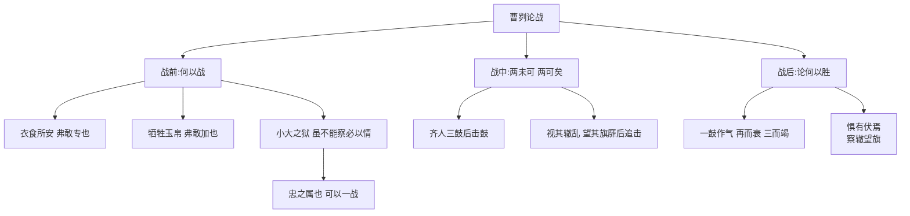

# 23 曹刿论战

标签：#文言文 #左传 #中考必考

## 一、文学常识

- 出处：《左传·庄公十年》。《左传》即《春秋左氏传》，相传为春秋末年鲁国史官左丘明所著，是我国第一部叙事详备的编年体史书，也是优秀的历史散文著作。
- 背景：公元前684年，齐鲁长勺之战。齐强鲁弱，鲁国以弱胜强，是历史上著名的以少胜多战例。

## 二、字词积累

### 重点实词

- **伐**：攻打。**间**（jiàn）：参与（"肉食者谋之，又何间焉"）。
- **鄙**：目光短浅（"肉食者鄙"）。
- **安**：养（"衣食所安"）。**专**：独自享有。
- **牺牲玉帛**（bó）：祭祀用的纯色全体牲畜和玉、丝织品。牺牲，古今异义。
- **加**：虚夸、夸大（"弗敢加也"）。**信**：实情。
- **孚**（fú）：使信服（"小信未孚"）。
- **狱**：诉讼事件（古今异义）。**察**：明察。**情**：诚，诚实（"必以情"）。
- **忠之属也**：（这是）尽职分之类的事情。
- **鼓**：击鼓进军（名词作动词）。**驰**：驱车追赶。
- **辙**（zhé）：车轮碾出的痕迹。**轼**（shì）：车前横木。
- **靡**（mǐ）：倒下（"望其旗靡"）。

### 重点句子

- "肉食者鄙，未能远谋。"
- "小大之狱，虽不能察，必以情。"
- "夫战，勇气也。一鼓作气，再而衰，三而竭。"

## 三、结构层次

1. 第1段：**战前**——曹刿问"何以战"，庄公三答，曹刿肯定"小大之狱，虽不能察，必以情"是"忠之属也，可以一战"——政治上取信于民是胜利的先决条件；
2. 第2段：**战中**——"公将鼓之，刿曰未可"，齐人三鼓后方出击；"公将驰之"，视辙望旗后方追击——两个"未可"两个"可矣"，写曹刿善于把握战机；
3. 第3段：**战后**——曹刿论述取胜原因："一鼓作气，再而衰，三而竭"（攻击时机）；"惧有伏焉""视其辙乱，望其旗靡"（追击时机）。

## 四、人物形象

- **曹刿**：有爱国心与责任感（主动请见），政治上有远见（知取信于民），军事上沉着果断、善于把握战机、谨慎周密（下视其辙）；
- **鲁庄公**：目光短浅（"鄙"，寄望于近臣神灵）但能虚心纳谏、用人不疑，非一无是处的昏君。

## 五、写作特色

1. **详略得当**：详写论战（战前问答、战后论述），略写战争过程——紧扣"论战"的题眼，突出曹刿的"远谋"；
2. 对比衬托：以庄公之"鄙"衬曹刿之"远谋"；
3. 语言精练，对话传神。

## 六、主题思想

文章记叙了长勺之战中曹刿对战争的论述及指挥作战的经过，说明政治上取信于民、军事上把握战机是弱国战胜强国的必要条件，塑造了曹刿深谋远虑的谋士形象。

## 七、练习题

1. 解释：间、鄙、牺牲、狱、鼓、靡。
2. 翻译："夫战，勇气也。一鼓作气，再而衰，三而竭。"
3. 曹刿认为"可以一战"的条件是什么？说明了什么道理？
4. 本文详写什么、略写什么？为什么这样安排？

## 八、知识联系

- 与[[24* 邹忌讽齐王纳谏]]同写进谏纳谏，可比较谋臣的讽谏艺术；
- 同为史传散文，叙事笔法可对照[[25* 陈涉世家]]；
- 忠臣直言的传统延续到[[26 出师表]]。
