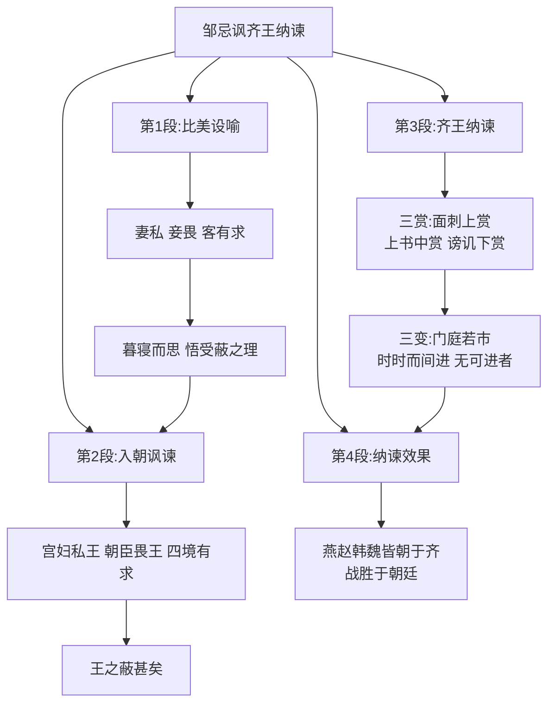

# 24* 邹忌讽齐王纳谏

标签：#文言文 #战国策 #讽谏艺术

## 一、文学常识

- 出处：《战国策·齐策一》。《战国策》是西汉刘向整理编订的国别体史书，共33篇，主要记载战国时期谋臣策士的言行。
- 题解："讽"，讽谏，用含蓄的话委婉地规劝；"纳谏"，接受规劝。标题概括了全文两方面内容。

## 二、字词积累

### 重点实词

- **修**：长，指身高（"邹忌修八尺有余"）。
- **昳丽**（yì）：光艳美丽。
- **窥镜**（kuī）：照镜子。
- **旦日**：第二天。**明日**：次日，第二天。
- **孰视**：仔细端详。孰，同"熟"，仔细。
- **美我**：认为我美（形容词意动用法）。
- **私**：偏爱（"吾妻之美我者，私我也"）。
- **蔽**：蒙蔽，文中指受蒙蔽（"王之蔽甚矣"）。
- **面刺**：当面指责。
- **谤讥于市朝**（bàng jī）：在公众场所指责讥刺（寡人的）过失。谤，公开指责。
- **门庭若市**：门前、院内像集市一样，形容进谏的人很多。
- **时时而间进**（jiàn）：常常偶尔有人进谏。
- **期年**（jī）：满一年。

### 词类活用与句式

- "朝服衣冠"：服，名词作动词，穿戴；
- "闻寡人之耳者"：闻，使……听到；
- "此所谓战胜于朝廷"：判断句兼状语后置。

## 三、结构层次

1. 第1段：**比美设喻**——邹忌与徐公比美，妻私、妾畏、客有求，皆言其美；暮寝而思，悟出"受蔽"之理；
2. 第2段：**入朝讽谏**——以家事喻国事："宫妇左右莫不私王，朝廷之臣莫不畏王，四境之内莫不有求于王"，推出"王之蔽甚矣"；
3. 第3段：**齐王纳谏**——下令三赏（面刺上赏、上书中赏、谤讥下赏），进谏由"门庭若市"到"无可进者"；
4. 第4段：**纳谏效果**——燕赵韩魏皆朝于齐，"战胜于朝廷"。

## 四、段落赏析

1. "三问三答"："我孰与城北徐公美？"妻、妾、客的回答语气各异（妻热情盛赞、妾拘谨附和、客敷衍逢迎），微妙传神。
2. 邹忌"暮寝而思之"：不因赞美而飘然，善于反思，由己及国，见其智慧；
3. 类比推理是本文讽谏艺术的核心：以"私、畏、求"三层家事类比国事，委婉含蓄又逻辑严密，使齐王欣然接受。
4. "三赏""三变"（门庭若市—时时而间进—无可进者）：数字化叙事，简洁而层次分明。

## 五、主题思想

文章记叙了邹忌以自身比美受蔽的经历设喻讽谏齐威王、齐威王虚心纳谏而使齐国大治的故事，说明只有广开言路、虚心接受批评意见才能兴利除弊、修明政治的道理。

## 六、写作特色

1. 设喻说理（类比推理），委婉动人；
2. 结构上"三叠"之美：三问三答、三比、三赏、三变；
3. 详略得当，语言简练生动。

## 七、练习题

1. 解释：修、私、蔽、面刺、期年。
2. 翻译："吾妻之美我者，私我也……欲有求于我也。"
3. 邹忌是如何由家事推及国事的？这种讽谏方式好在哪里？
4. 从齐威王身上你得到什么启示？

## 八、知识联系

- 与[[23 曹刿论战]]比较：一为战场论略，一为朝堂讽谏，同显谋士智慧；
- 直谏与讽谏的差异可对照[[26 出师表]]中诸葛亮的恳切直言；
- 劝说的语言艺术可迁移到[[写作：学会深入思考]]的思辨训练。
