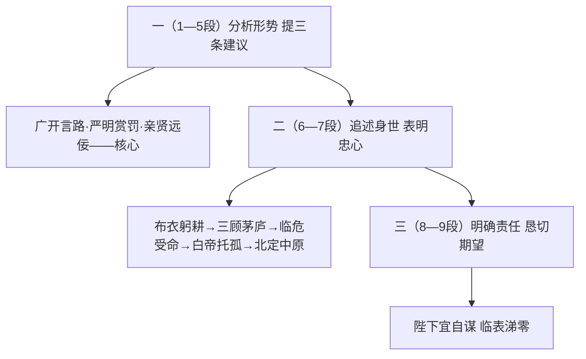

# 26 出师表

标签：#文言文 #诸葛亮 #中考必考

## 一、文学常识

- 作者：诸葛亮（181—234），字孔明，琅琊阳都人，三国时期蜀汉丞相，杰出的政治家、军事家。
- "表"：古代向帝王上书陈情言事的一种文体，以抒情为主，"动之以情"是其特征。
- 背景：蜀汉建兴五年（227），诸葛亮驻军汉中，准备北伐曹魏，出师前上此表给后主刘禅，陈述意见，劝勉后主。陆游赞："出师一表真名世，千载谁堪伯仲间。"

## 二、字词积累

### 重点实词

- **崩殂**（cú）：帝王之死。
- **疲弊**（bì）：人力疲惫，物力缺乏。
- **秋**：时候（"危急存亡之秋"）。
- **殊遇**：优待，厚遇。
- **开张圣听**：扩大圣明的听闻，指广泛听取意见。
- **妄自菲薄**（fěi bó）：随意地看轻自己。
- **陟罚臧否**（zhì zāng pǐ）：晋升、处罚，赞扬、批评。
- **作奸犯科**：做奸邪事情，触犯科条。
- **裨补阙漏**（bì quē）：弥补缺失疏漏。
- **性行淑均**（xíng shū jūn）：性情品德善良公正。
- **躬耕**（gōng）：亲自耕种。
- **卑鄙**：社会地位低微，见识短浅（古今异义）。
- **猥自枉屈**（wěi）：屈尊就卑。
- **夙夜忧叹**（sù）：早晚忧愁叹息。
- **驽钝**（nú dùn）：比喻才能平庸。
- **攘除奸凶**（rǎng）：排除、铲除奸邪凶恶的敌人。
- **斟酌损益**（zhēn zhuó）：斟情酌理、有所兴革。
- **咨诹善道**（zōu）：询问治国的好道理。

### 成语出处

三顾茅庐、妄自菲薄、作奸犯科、危急存亡之秋、计日而待、亲贤远佞。

## 三、结构层次

1. 第一部分（1—5段）：**分析形势，提出建议**——
   - 形势：先帝创业未半而中道崩殂，此诚危急存亡之秋；
   - 三条建议：①**广开言路**（开张圣听）；②**严明赏罚**（陟罚臧否，不宜异同）；③**亲贤远佞**（亲贤臣，远小人——核心建议），并举荐郭攸之、费祎、董允、向宠等文武贤臣；
2. 第二部分（6—7段）：**追述身世，表明忠心**——由布衣躬耕到三顾茅庐、临危受命、白帝托孤，二十一年风雨，"报先帝而忠陛下"；申明北伐目标："北定中原……兴复汉室，还于旧都"；
3. 第三部分（8—9段）：**明确责任，恳切期望**——分清自己、朝臣、后主各自职责，"临表涕零，不知所言"。

## 四、段落赏析

1. "亲贤臣，远小人，此先汉所以兴隆也；亲小人，远贤臣，此后汉所以倾颓也"：正反对比，以两汉兴衰史实证明亲贤远佞的极端重要，是三条建议的核心。
2. "臣本布衣，躬耕于南阳……"：自叙身世，追念先帝知遇之恩，情辞恳切，"受任于败军之际，奉命于危难之间"对仗工稳，感人至深。
3. 全文十三次提"先帝"，七次提"陛下"："报先帝、忠陛下"的赤诚贯穿始终，议论中融入叙事与抒情。

## 五、主题思想

诸葛亮在出师北伐之际，向后主提出广开言路、严明赏罚、亲贤远佞三条建议，追述先帝知遇之恩，表达了"北定中原、兴复汉室"的决心和"报先帝、忠陛下"的一片忠忱。

## 六、写作特色

1. 议论为主，叙事、抒情相结合，情理交融；
2. 言辞恳切委婉，既尽人臣之礼，又存长辈之情；
3. 语言质朴精练，多用四字句与对偶。

## 七、练习题

1. 解释：秋、妄自菲薄、卑鄙、夙夜忧叹、斟酌损益。
2. 诸葛亮提出了哪三条建议？核心是哪一条？为什么？
3. 翻译："受任于败军之际，奉命于危难之间。"
4. 文中"报先帝"之情体现在哪些叙事中？

## 八、知识联系

- 忠臣进言可与[[24* 邹忌讽齐王纳谏]]的讽谏、[[23 曹刿论战]]的献策比较；
- 三国历史背景可联系[[27 诗词曲五首]]相关咏史作品；
- "鞠躬尽瘁"精神与[[综合性学习：君子自强不息]]相通。
