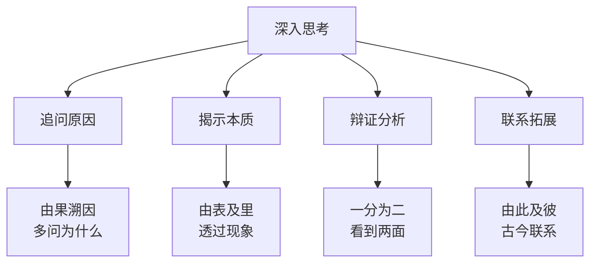

# 写作：学会深入思考

标签：#写作 #思辨 #立意

## 一、写作目标

学会对现象、材料、观点进行**由表及里、由此及彼、多角度**的深入思考，使文章立意深刻、见解独到。

## 二、为什么要深入思考

浅思考只看表面："他成功因为努力"；深思考追问本质："努力为什么在他身上生效？方向、方法、时代机遇起了什么作用？"文章的高下之别，往往在思考的深浅。

## 三、深入思考的四条路径

### 1. 追问原因（由果溯因）

多问几个"为什么"。如读[[15 故乡]]：闰土为什么变了？——多子饥荒苛税是表层，封建等级观念的精神奴役是深层。

### 2. 揭示本质（由表及里）

透过现象看本质。如[[16 我的叔叔于勒]]：菲利普夫妇躲的不是于勒，是"贫穷"，折射金钱社会的人际本质。

### 3. 辩证分析（一分为二）

避免绝对化，看到事物的两面与转化。如"孤独"既是痛苦也是成长的契机（见[[17* 孤独之旅]]）；"怀疑"须以"思索、辨别"为后续（见[[8 怀疑与学问]]）。

### 4. 联系拓展（由此及彼）

由个别到一般，由古及今。如从[[27 诗词曲五首]]"兴，百姓苦；亡，百姓苦"联想到"以民为本"的当代意义。

## 四、思考成果的呈现

1. **提炼分论点**：把思考的不同层面转化为递进式分论点（是什么—为什么—怎么办）；
2. **让步说理**："诚然……然而……"承认对方合理处再深入一层；
3. **设问推进**：文中自问自答，带动读者思维；
4. 结尾升华：从个人到社会、从现象到规律。

## 五、示例：从材料到立意

材料：某同学沉迷刷短视频，成绩下滑。

- 浅立意：短视频有害，要远离；
- 深立意一（追因）：碎片刺激取代深度专注，是注意力被"算法"捕获；
- 深立意二（辩证）：工具无罪，关键在人对工具的驾驭——"役物而不役于物"；
- 深立意三（拓展）：数字时代的自律是新的必修课（可联系[[综合性学习：我们的数字时代]]）。

## 六、写作实践（教材题目）

1. 针对"班级要不要设立'手机保管箱'"写一段有深度的分析文字；
2. 以《也谈"近朱者赤，近墨者黑"》为题，运用辩证分析写一篇议论文，不少于600字；
3. 从本学期读过的小说中任选一篇，写一篇600字左右的文学短评，力求见解深入。

## 七、自查清单

- [ ] 是否至少追问了两层"为什么"？
- [ ] 有没有辩证的让步分析？
- [ ] 立意是否超出了"人人都能想到"的层面？
- [ ] 分论点之间是否体现思维的递进？

## 八、知识联系

- 与[[写作：观点要明确]][[写作：议论要言之有据]][[写作：论证要合理]]构成议论文写作完整序列；
- 思辨范文可读[[8 怀疑与学问]][[20 中国人失掉自信力了吗]]；
- 小说主题的深层解读见[[15 故乡]][[16 我的叔叔于勒]]。
