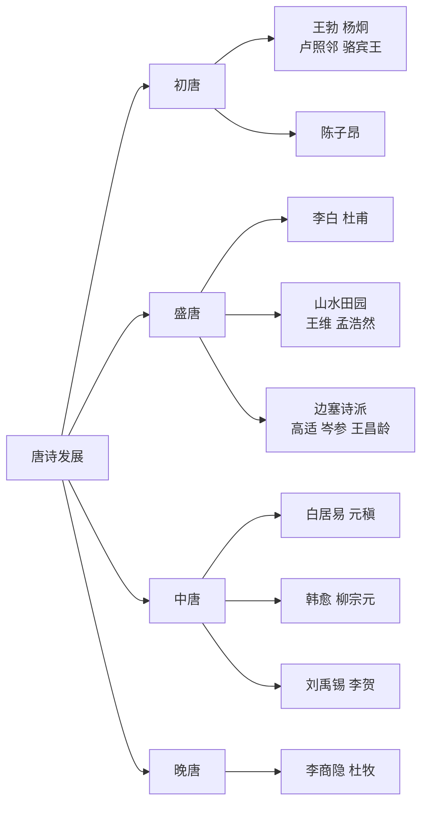

# 整本书阅读：《唐诗三百首》

标签：#名著阅读 #唐诗 #整本书阅读

## 一、作品概况

- 《唐诗三百首》是清代乾隆年间**孙洙**（蘅塘退士）编选的唐诗选本，共选77位诗人的310余首诗作，按诗体分为五言古诗、七言古诗、五言律诗、七言律诗、五言绝句、七言绝句及乐府等类。
- 编选宗旨："熟读唐诗三百首，不会作诗也会吟"，选诗兼顾名家名篇与通俗易诵，是流传最广的唐诗启蒙读本。

## 二、唐诗发展脉络

1. **初唐**：四杰（王勃、杨炯、卢照邻、骆宾王）与陈子昂，扫除齐梁绮靡，开风气之先；
2. **盛唐**：巅峰期——李白的浪漫飘逸、杜甫的沉郁顿挫；山水田园派（王维、孟浩然）与边塞派（高适、岑参、王昌龄）双峰并峙；
3. **中唐**：白居易、元稹倡新乐府，韩愈、柳宗元古文运动兼擅诗歌，刘禹锡、李贺各具风神；
4. **晚唐**："小李杜"——李商隐的深情绵邈、杜牧的俊爽峭健。

## 三、代表诗人与风格

| 诗人 | 称号 | 风格 | 代表作 |
| --- | --- | --- | --- |
| 李白 | 诗仙 | 豪放飘逸 | 《行路难》《将进酒》 |
| 杜甫 | 诗圣 | 沉郁顿挫 | 《望岳》《月夜忆舍弟》 |
| 王维 | 诗佛 | 诗中有画 | 《山居秋暝》 |
| 白居易 | 诗魔 | 平易通俗 | 《琵琶行》《钱塘湖春行》 |
| 李商隐 | — | 朦胧深情 | 《无题》《夜雨寄北》 |

## 四、阅读方法指导

### 1. 分体裁读

体会古体诗的自由奔放与近体诗（律诗、绝句）的格律之美：律诗八句，中间两联对仗；绝句四句，贵在含蓄。

### 2. 分题材读

送别诗、边塞诗、山水田园诗、咏史怀古诗、思乡诗、爱情诗——归类比较，把握各类诗的常见意象与情感（方法同[[任务一 学习鉴赏]]）。

### 3. 知人论世

结合诗人生平与时代读诗：读杜甫需知安史之乱，读[[14 诗词三首]]中李白《行路难》需知"赐金放还"。

### 4. 诵读积累

坚持每日诵读，先读准字音节奏，再体会情感（可用[[任务二 诗歌朗诵]]的停连重音方法），精彩篇目熟读成诵。

## 五、专题探究建议

1. 专题一："月"意象研究——从《静夜思》到《月夜忆舍弟》，整理"月"的多重含义；
2. 专题二：唐代送别诗中的深情——比较王维、李白、高适送别诗的不同写法；
3. 专题三：为你喜爱的一位诗人编一份"小传＋诗选＋点评"手册。

## 六、练习题

1. 《唐诗三百首》的编者是谁？编选宗旨是什么？
2. 简述唐诗四个时期各自的代表诗人。
3. 任选一首熟悉的律诗，指出其对仗的一联并赏析。
4. 以"意象"为线索，比较两首同题材唐诗。

## 七、知识联系

- 课内唐诗可与本书互证：[[14 诗词三首]][[课外古诗词诵读]][[27 诗词曲五首]]；
- 鉴赏与朗诵方法见[[任务一 学习鉴赏]][[任务二 诗歌朗诵]]；
- 整本书阅读经验可与[[整本书阅读：《简·爱》]]的方法互相迁移。
