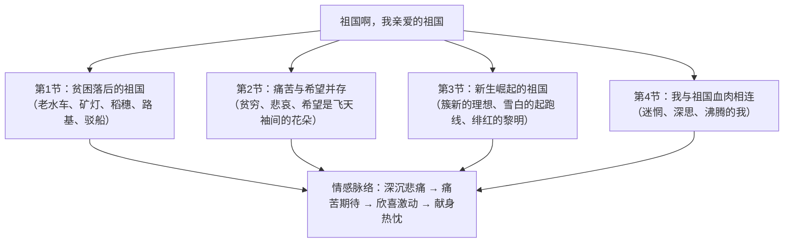

# 1 祖国啊，我亲爱的祖国

标签：#现代诗 #舒婷 #朦胧诗

## 一、文学常识

- 作者：舒婷，原名龚佩瑜，当代女诗人，朦胧诗派代表人物之一，代表作《致橡树》《双桅船》。
- 背景：写于 1979 年，"文革"结束、改革开放之初，诗人以赤子之心抒发对饱经磨难而走向新生的祖国的深情。
- 文体：抒情诗（现代诗），采用意象叠加、直抒胸臆相结合的方式。

## 二、字词积累

- **疲惫**（bèi）：极度疲乏。
- **干瘪**（biě）：干枯收缩，不丰满。
- **淤滩**（yū tān）：淤泥形成的滩地。
- **驳船**（bó）：没有动力装置、由拖轮牵引的船。
- **簇新**（cù）：极新、全新。
- **胚芽**（pēi）：植物幼体的组成部分，喻新生事物的开端。
- **迷惘**（wǎng）：由于分辨不清而困惑，不知怎么办。
- **绯红**（fēi）：鲜红。

## 三、结构层次

## 四、诗句赏析

1. "我是你河边上破旧的老水车，数百年来纺着疲惫的歌"：以"老水车"意象象征祖国历史的贫困、落后与沉重，"数百年"点出时间跨度，"疲惫"移情于物。
2. "是'飞天'袖间千百年未落到地面的花朵"：化用敦煌壁画"飞天"意象，写希望美好却遥不可及，痛苦中含期盼。
3. "我是你簇新的理想，刚从神话的蛛网里挣脱"：写新时期祖国摆脱迷信僵化、焕发生机，与前两节形成鲜明对照。
4. "那就从我的血肉之躯上去取得你的富饶、你的荣光、你的自由"：直抒胸臆，表达甘愿为祖国献身的赤子深情，将全诗情感推向高潮。

## 五、主题思想

诗人把"我"与祖国融为一体，通过一组组意象展现祖国从苦难走向新生的历程，抒发了与祖国同呼吸、共命运、甘于奉献的深挚爱国之情。

## 六、写作特色

1. 意象新颖密集：老水车、矿灯、驳船、胚芽、起跑线等，具体可感又富象征意味；
2. "我是你……"的排比复沓句式，回环往复，情感层层推进；
3. 每节以"——祖国啊"收束，如深情呼告，一唱三叹；
4. 第一人称抒情，"小我"与"大我"交融，体现朦胧诗以个体体验写时代情感的特点。

## 七、练习题

1. 第 1 节选取了哪些意象？共同表现了祖国怎样的特点？
2. 赏析"是'飞天'袖间千百年未落到地面的花朵"。
3. 全诗四节的感情基调有何变化？请梳理情感脉络。
4. 诗中的"我"仅指诗人自己吗？谈谈你的理解。

## 八、知识联系

- 与[[2* 梅岭三章]]同属本单元革命与爱国主题诗歌，可比较旧体诗与新诗的抒情方式；
- 与[[3* 短诗五首]]比较现代诗意象运用的异同；
- 与[[4 海燕]]同以象征手法抒写时代精神；
- 本诗的意象扩展可作为[[写作：学习扩写]]的素材训练。
