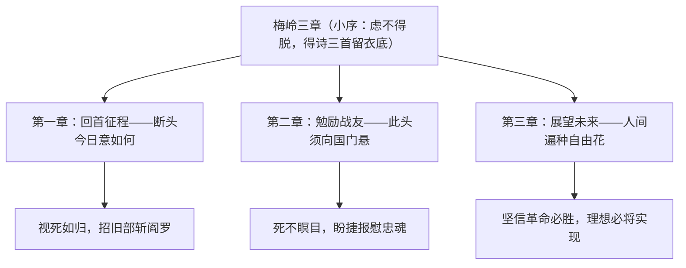

# 2* 梅岭三章

标签：#现代诗 #陈毅 #革命诗歌

## 一、文学常识

- 作者：陈毅（1901—1972），字仲弘，无产阶级革命家、军事家、诗人，中华人民共和国元帅。
- 背景：1936 年冬，陈毅在梅山被国民党军围困二十余日，伤病伏丛莽间，自料难免牺牲，写下这三首"绝命诗"藏于棉衣内层。
- 文体：旧体诗（七言绝句组诗），前有小序交代写作缘由。

## 二、字词积累

- **旌旗**（jīng qí）：旗帜的总称，诗中借指部队。
- **阎罗**：即阎罗王，迷信中掌管地狱的神，诗中借指反动统治者。
- **烽烟**：古代边境报警的烟火，诗中借指战争。
- **捷报**：胜利的消息。
- **血雨腥风**：借喻反动派对革命人民的血腥镇压。
- **取义成仁**：即"舍生取义""杀身成仁"，为真理和正义事业而牺牲。

## 三、结构层次

## 四、诗句赏析

1. "此去泉台招旧部，旌旗十万斩阎罗"："招""斩"二字力重千钧，即使牺牲也要率旧部与反动派血战到底，想象奇特，气魄豪迈。
2. "此头须向国门悬"：化用伍子胥"悬首东门"典故，表示死后仍要亲见革命胜利，写出至死不渝的执着。
3. "捷报飞来当纸钱"：以"捷报"代"纸钱"，一个"飞"字轻快传神，把对胜利的期盼写得深挚而豪迈。
4. "取义成仁今日事，人间遍种自由花"：化用儒家"舍生取义""杀身成仁"，赋予其无产阶级革命的新内涵；"自由花"象征革命成功、人民解放的美好前景。

## 五、主题思想

组诗表现了诗人身处绝境时视死如归的英雄气概、对革命事业的无限忠诚和对共产主义理想必将实现的坚定信念。

## 六、写作特色

1. 三章一体，脉络分明：一问一勉一望，由今日写到身后再到未来；
2. 想象、借代、引用（用典）等手法综合运用，"泉台""阎罗"化虚为实；
3. 语言凝练豪壮，把生死大义写得从容不迫；
4. 小序与诗互相配合，交代背景，突出"绝境赋诗"的悲壮。

## 七、练习题

1. 小序在全诗中有什么作用？
2. "旌旗""烽烟"各借指什么？这种手法叫什么？
3. 赏析"此去泉台招旧部，旌旗十万斩阎罗"。
4. 三章在内容上各有侧重，请分别概括。

## 八、知识联系

- 与[[1 祖国啊，我亲爱的祖国]]同抒爱国深情，可比较豪壮与深沉两种风格；
- "取义成仁"与[[9 鱼我所欲也]]"舍生取义"思想一脉相承；
- 与[[3* 短诗五首]]比较旧体诗与新诗的形式差异；
- 借代、用典等手法可迁移到[[12 词四首]]的鉴赏中。
