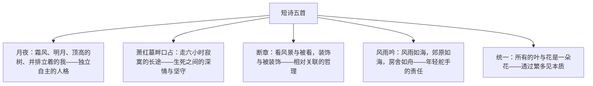

# 3* 短诗五首

标签：#现代诗 #新诗 #意象

## 一、文学常识

- 《月夜》：沈尹默作，1918 年发表于《新青年》，是新诗史上最早的作品之一，写于五四运动前夜。
- 《萧红墓畔口占》：戴望舒作，1944 年拜谒女作家萧红墓时口占而成；戴望舒为现代派诗人，代表作《雨巷》。
- 《断章》：卞之琳作，写于 1935 年，节自长诗，仅四行而意蕴无穷。
- 《风雨吟》：芦荻作，写于 1941 年抗战时期，以风雨象征动荡的时代。
- 《统一》：聂鲁达作，智利诗人，1971 年诺贝尔文学奖得主，此诗以哲理见长。

## 二、字词积累

- **口占**：不打草稿，随口吟诵而成（诗）。
- **漫漫**：（时间、地方）长而无边的样子。
- **装饰**：起修饰美化作用的物品，诗中含耐人寻味的哲理意味。
- **舵手**（duò）：掌舵的人，喻把握方向的引领者。
- **繁多**：（种类）多，丰富。

## 三、结构层次

## 四、诗句赏析

1. "我和一株顶高的树并排立着，却没有靠着"（《月夜》）："并排立着"写平等，"没有靠着"写独立，含蓄表现五四时期觉醒的独立人格与自由精神。
2. "我等待着，长夜漫漫；你却卧听着海涛闲话"（《萧红墓畔口占》）："等待"与"卧听"、生者与逝者对举，深沉的悼念中含着坚忍与豁达。
3. "你站在桥上看风景，看风景的人在楼上看你"（《断章》）：主客体互换，揭示宇宙万物相互依存、相互关联的哲理，言浅意深。
4. "年轻舵手的心"（《风雨吟》）："大地风雨"象征动荡不安的时代与社会，"舵手"写出年轻人面对风雨勇于掌舵的责任感与使命感。
5. "繁多是个谎言"（《统一》）：由叶、花的个别与一般，推及事物"多样中的统一"，引导读者透过现象看本质。

## 五、主题思想

五首短诗或写独立人格（《月夜》），或写生死深情（《萧红墓畔口占》），或写万物关联（《断章》），或写时代责任（《风雨吟》），或写对立统一（《统一》），共同展示了新诗以凝练意象承载深刻情思的魅力。

## 六、写作特色

1. 篇幅短小而意蕴丰厚，讲究留白，耐人咀嚼；
2. 意象经营精巧：明月、长途、风景、风雨、叶与花，均由实入虚；
3. 象征与哲理化倾向明显，体现新诗从抒情向智性的拓展；
4. 语言口语化而有节奏感，形式自由。

## 七、练习题

1. 《月夜》中"没有靠着"有何深意？结合时代背景分析。
2. 《断章》表达了怎样的哲理？"装饰"一词妙在何处。
3. 《风雨吟》中"风雨""海""舟""舵手"分别象征什么？
4. 比较五首短诗在意象选择与主题上的异同。

## 八、知识联系

- 与[[1 祖国啊，我亲爱的祖国]]同为现代诗，可比较意象密度与抒情方式；
- 《风雨吟》的象征手法与[[4 海燕]]相通；
- 与[[2* 梅岭三章]]比较新旧诗体的表达差异；
- 短诗扩展成文可作[[写作：学习扩写]]的练习材料。
