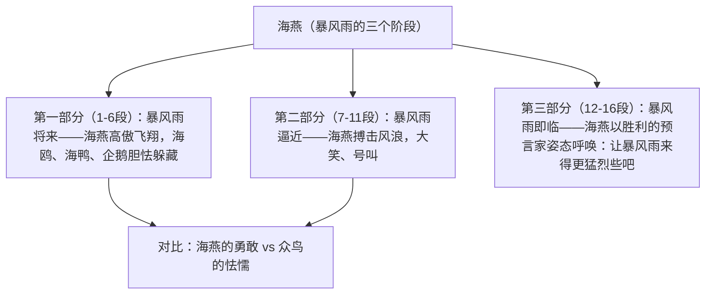

# 4 海燕

标签：#散文诗 #高尔基 #象征

## 一、文学常识

- 作者：高尔基（1868—1936），苏联作家，社会主义现实主义文学奠基人，代表作自传体三部曲《童年》《在人间》《我的大学》、长篇小说《母亲》。
- 背景：写于 1901 年俄国 1905 年革命前夕，是幻想曲《春天的旋律》的结尾章，发表后被誉为"战斗的革命诗歌"。
- 文体：散文诗——兼有散文的形式自由与诗的凝练抒情。

## 二、字词积累

- **苍茫**：空阔辽远，没有边际。
- **高傲**：本指自以为了不起、看不起人，文中贬词褒用，指海燕的矫健豪迈。
- **呻吟**（shēn yín）：指人因痛苦而发出声音，文中写海鸥的胆怯。
- **翡翠**（fěi cuì）：文中比喻绿色的海浪。
- **蜿蜒**（wān yán）：（蛇类）爬行的样子，文中形容闪电。
- **困乏**：疲乏，文中写海鸭被吓坏的状态。

## 三、结构层次

## 四、段落赏析

1. "在苍茫的大海上，狂风卷集着乌云"：开篇勾勒典型环境，"卷集"写出黑暗势力压城的紧张气氛。
2. "海燕像黑色的闪电，在高傲地飞翔"：比喻兼夸张，"黑色的闪电"写形写速，"高傲"贬词褒用，塑造勇敢无畏的战士形象。
3. 海鸥"呻吟""飞窜"、海鸭"吓坏"、企鹅"胆怯地把肥胖的身体躲藏在悬崖底下"：以三类海鸟象征假革命者与不革命者，反衬海燕的英勇。
4. "——暴风雨！暴风雨就要来啦！""让暴风雨来得更猛烈些吧！"：反复与呼告，把渴望革命风暴的激情推向顶点，是全文最强音。

## 五、主题思想

作品以象征手法，通过暴风雨来临前海燕搏击风浪的英姿，热情歌颂了俄国无产阶级革命先驱者坚强无畏的战斗精神，预示革命风暴必将到来、必将胜利。

## 六、写作特色

1. 通篇象征：海燕象征革命先驱，暴风雨象征革命风暴，大海波浪象征人民力量，乌云狂风象征反动势力，海鸥海鸭企鹅象征形形色色害怕革命的人；
2. 对比、烘托：以众鸟之怯衬海燕之勇，以环境之险衬形象之豪；
3. 场景推进式结构，气氛步步升级；
4. 语言充满激情，多用比喻、拟人、反复、呼告。

## 七、练习题

1. 文中的海燕、暴风雨、海鸥等分别象征什么？
2. 赏析"海燕像黑色的闪电，在高傲地飞翔"。
3. 全文按什么线索安排场景？三个画面各有什么特点？
4. "让暴风雨来得更猛烈些吧！"表达了怎样的感情？

## 八、知识联系

- 与[[1 祖国啊，我亲爱的祖国]][[3* 短诗五首]]同属第一单元诗歌（散文诗），象征手法可互相印证；
- 与[[2* 梅岭三章]]同颂革命者的无畏精神；
- 象征、对比手法可迁移到[[写作：学习扩写]]中的形象扩展训练。
