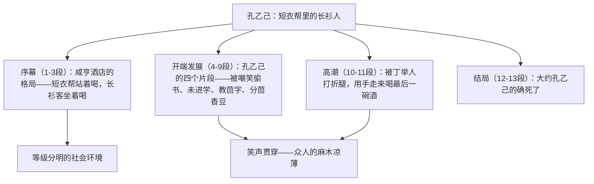

# 5 孔乙己

标签：#小说 #鲁迅 #中考重点

## 一、文学常识

- 作者：鲁迅（1881—1936），原名周树人，字豫才，浙江绍兴人，文学家、思想家、革命家。本文选自小说集《呐喊》，写于 1918 年冬，是《狂人日记》之后的第二篇白话小说。
- 背景：清末科举制度虽废，封建文化和等级观念仍毒害着知识分子与民众，作者借孔乙己的悲剧"描写一般社会对于苦人的凉薄"。
- 文体：短篇小说，以咸亨酒店小伙计"我"的视角叙述。

## 二、字词积累

- **阔绰**（chuò）：排场大，生活奢侈。
- **羼**（chàn）：混和，掺杂。
- **绽出**（zhàn）：突露出来。
- **间或**（jiàn）：偶然，有时候。
- **颓唐**（tuí）：精神不振作。
- **不屑置辩**（xiè）：认为不值得分辩。
- **君子固穷**：君子能安于穷困（语出《论语》）。
- **营生**：谋生，筹划如何生活。

## 三、结构层次与人物

## 四、人物与段落赏析

1. "孔乙己是站着喝酒而穿长衫的唯一的人"：一句话点明其尴尬地位——经济上沦为"短衣帮"，思想上死抱"长衫"的读书人身份，是全篇文眼。
2. "排出九文大钱"与后文"摸出四文大钱"："排"写出他拮据而炫耀的穷酸，"摸"写出穷困潦倒至极，一字之差见境遇巨变。
3. "窃书不能算偷……读书人的事，能算偷么？"：迂腐可笑的强辩，自欺欺人，是科举文化毒害的活标本。
4. "大约孔乙己的确死了"："大约"与"的确"看似矛盾：无人关心故只能推测（大约），而在那个凉薄社会他必死无疑（的确），含蓄有力。

## 五、主题思想

小说通过孔乙己被科举制度戕害、被冷酷社会吞噬的悲剧，深刻揭露了封建科举制度和封建文化的罪恶，批判了民众的麻木冷漠，表达了对"苦人"的深切同情。

## 六、写作特色

1. 以"笑"写悲：众人的哄笑贯穿全篇，笑声愈响，悲剧愈深；
2. 第一人称限制视角（小伙计"我"），冷静客观又暗含讽刺；
3. 外貌、语言、动作描写精当传神（"排""摸"、之乎者也）；
4. 社会环境描写（酒店格局）浓缩了等级社会的缩影。

## 七、练习题

1. 小说为什么以咸亨酒店为背景？开头三段有什么作用？
2. 比较"排出九文大钱"与"摸出四文大钱"的表达效果。
3. 文中多次写"笑"，各有什么含义？
4. 如何理解"大约孔乙己的确死了"？

## 八、知识联系

- 与[[6 变色龙]]同为讽刺小说，可比较中外讽刺艺术；
- 与[[21 范进中举]]同写科举毒害的读书人，孔乙己（落第者）与范进（中举者）互为镜像；
- 小说的社会环境作用分析可迁移到[[7* 溜索]]的自然环境；
- 分析主题前的材料把握与[[写作：审题立意]]相通。
