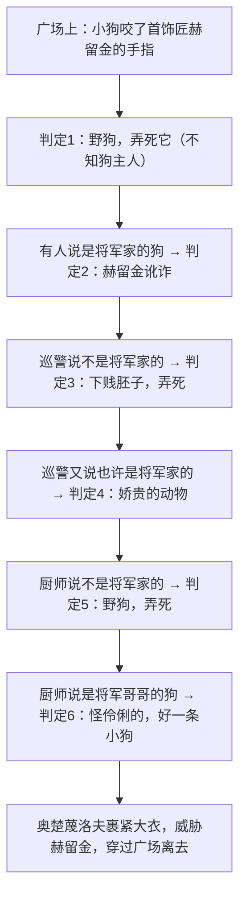

# 6 变色龙

标签：#小说 #契诃夫 #讽刺

## 一、文学常识

- 作者：契诃夫（1860—1904），俄国作家、戏剧家，与莫泊桑、欧·亨利并称"世界三大短篇小说巨匠"，代表作《装在套子里的人》《凡卡》、剧本《万尼亚舅舅》。
- 背景：写于 1884 年，沙皇亚历山大三世强化警察统治的黑暗时期，警察既欺压百姓又谄媚权贵。
- 文体：短篇讽刺小说。"变色龙"本是善变体色的蜥蜴，喻指见风使舵、媚上欺下的人。

## 二、字词积累

- **魁梧**（kuí wú）：（身体）强壮高大。
- **筛子**（shāi）：用竹篾、铁丝等做成的有孔器具。
- **坎肩**（kǎn）：无袖的上衣。
- **旗帜**（zhì）：旗子，文中喻立场标志。
- **荒唐**（huāng táng）：（思想、言行）错误到使人觉得奇怪的程度。
- **洋溢**（yì）：（情绪、气氛等）充分流露。
- **无精打采**：形容不高兴、不振作。
- **异想天开**：形容想法离奇，不切实际。

## 三、情节结构（六次判定、五次变色）

## 四、人物与细节赏析

1. 奥楚蔑洛夫对狗的称呼从"野狗""下贱胚子"到"名贵的狗""怪伶俐的"，态度随"狗主人是谁"六次反转，媚上欺下的奴性嘴脸暴露无遗。
2. **军大衣细节**（穿—脱—穿—裹紧）：四次写大衣，既是他掩饰窘态、变色转弯的道具，也是沙皇警察权力的象征。
3. "我早晚要收拾你！"：结尾对赫留金的威胁，表明受害者反成有罪者，深化了对黑暗社会的批判。
4. 环境描写"广场上一个人也没有……门口连一个乞丐也没有"：萧条冷落，暗示警察统治下的社会死气沉沉。

## 五、主题思想

小说通过警官奥楚蔑洛夫处理"狗咬人"事件时反复无常的丑态，辛辣讽刺了沙皇专制统治下趋炎附势、见风使舵、媚上欺下的走狗形象，揭露了当时社会的黑暗与畸形。

## 六、写作特色

1. 以对话推动情节，人物语言高度个性化；
2. 夸张与对比：判定的急速反转形成强烈讽刺；
3. 细节描写画龙点睛（军大衣、手指头）；
4. 题目一语双关，"变色龙"成为世界文学中势利小人的代名词。

## 七、练习题

1. 奥楚蔑洛夫"变"的是什么，"不变"的又是什么？
2. 文中四次写军大衣有什么作用？
3. 赫留金的手指头在情节中起什么作用？
4. 结合课文分析本文的讽刺手法。

## 八、知识联系

- 与[[5 孔乙己]]同为讽刺小说，一冷峻含蓄一夸张辛辣，可比较阅读；
- 与[[7* 溜索]]同属本单元小说，可比较人物塑造手法；
- 对话描写、细节讽刺可用于[[写作：审题立意]]后的记叙文写作；
- 人物性格的戏剧性转变可与[[18 天下第一楼（节选）]]的戏剧冲突比较。
