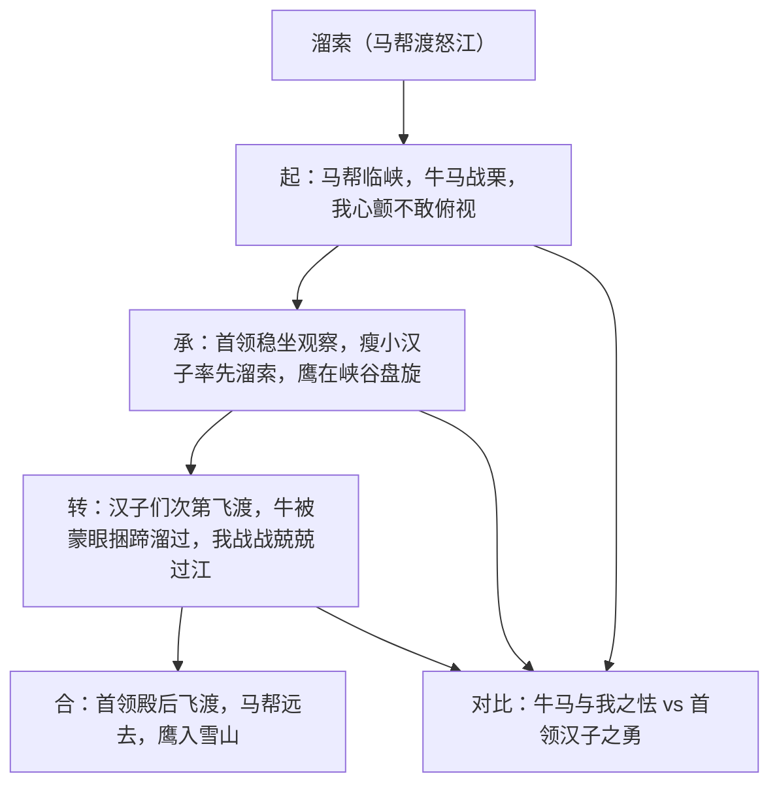

# 7* 溜索

标签：#小说 #阿城 #笔记体

## 一、文学常识

- 作者：阿城，原名钟阿城，1949 年生于北京，当代作家，"寻根文学"代表人物，代表作"三王"系列：《棋王》《树王》《孩子王》。
- 选文：本文选自笔记小说集《遍地风流》，写马帮借溜索横渡怒江大峡谷的经过。
- 文体：笔记体短篇小说，语言极简，白描传神。

## 二、字词积累

- **锱铢**（zī zhū）：古代很小的重量单位，喻极其微小的数量。
- **滇西**（diān）：云南西部。
- **盘桓**（huán）：逗留，徘徊。
- **顷刻**（qǐng）：极短的时间。
- **千钧之力**：形容力量极大（三十斤为一钧）。
- **绞**（jiǎo）：拧，文中写鹰"绞"入天空的矫健。
- **战战兢兢**（jīng）：形容因害怕而微微发抖的样子。

## 三、情节结构

## 四、段落赏析

1. "万丈绝壁飞快垂下去"：明明是人俯视深谷，却说绝壁"垂下去"，以动写静，突出峡谷之险与心理之惧。
2. 首领"只懒懒说是怒江，要过溜索了"："懒懒""稳稳"等词写出首领面对天险从容不迫，与"我"的惊恐形成对比。
3. 写牛"皮肉开始抖""屎尿尽数撒泄"：以牲畜的极度恐惧侧面烘托怒江之险，反衬马帮汉子的沉着骁勇。
4. 鹰的三次出现（盘旋—扎进山口—翅膀一鼓一鼓扇动）：雄鹰意象与马帮汉子互相映衬，象征勇敢无畏、搏击天险的生命力量。

## 五、主题思想

小说通过马帮溜索横渡怒江的惊险场面，赞美了西南边地马帮汉子沉着果断、彪悍勇敢的性格，表现了人在雄奇险峻的大自然面前迸发的原始生命力。

## 六、写作特色

1. 白描笔法：多用短句，少修饰语，动词精准（"绞""荡""扯"）；
2. 多重对比与侧面烘托：牛马之怯、"我"之惧衬首领汉子之勇；
3. 以"我"的观察为视角，限制叙事增强现场感；
4. 意象经营：鹰、峡谷、溜索构成雄浑苍劲的画面，语言有金石之声。

## 七、练习题

1. 小说开头写鹰、写牛马有什么作用？
2. 首领是怎样一个人？作者用了哪些手法塑造他？
3. 赏析"万丈绝壁飞快垂下去"的表达效果。
4. 本文语言风格有何特点？举例说明。

## 八、知识联系

- 与[[5 孔乙己]][[6 变色龙]]同属本单元小说，可比较白描与讽刺的不同笔法；
- 环境烘托人物的手法可迁移到[[20 智取生辰纲]]"黄泥冈烈日"的分析；
- 简省传神的语言是[[写作：修改润色]]中"炼字炼句"的范例；
- 选材与视角的确定可结合[[写作：审题立意]]学习。
