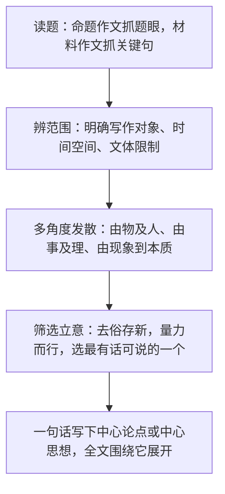

# 写作：审题立意

标签：#写作 #审题 #立意

## 一、技法要点

1. **审题**：审清题目（或材料）的含义、范围和要求，包括题眼（关键词）、限制条件（时间、对象、文体、字数）和隐含信息。
2. **立意**：在审题基础上确立文章的中心思想。要求：正确（符合主流价值观）、集中（一文一意）、深刻（由表及里）、新颖（人无我有，人有我新）。
3. **审题三看**：一看关键词，二看修饰语与限制语，三看提示语与要求。
4. **立意三步**：先求"稳"（不偏题），再求"深"（挖掘本质），后求"新"（独特角度）。

## 二、步骤方法

- 命题作文：如"心中的一泓清泉"，题眼是"清泉"（比喻义：滋润心灵的人、事、情、理），"心中"限定了写内在感受。
- 材料作文：先概括材料内容，再提炼寓意，从赞成、反对、辩证等角度立意，选择最切合材料核心的角度。
- 半命题作文：补题即立意，补出的词要具体、易写、有情味。

## 三、常见问题

1. **偏题跑题**：只抓个别字眼，忽视整体含义（把"温暖的旅程"只写成旅游）；
2. **立意平庸**：人云亦云，满足于表面感想；
3. **多中心**：一篇文章想表达几个主题，结果哪个都不突出；
4. **拔高失真**：强行上升到宏大主题，与选材脱节；
5. **忽视文体与要求**：题目要求记叙文却写成议论文。

## 四、实践练习

1. 分析题目"翻过那座山"的本义与比喻义，各列出两个立意。
2. 给材料"一只蜗牛想干一番大事业，却因目标太大而放弃，最终一事无成"写出三个不同角度的立意，并选定最佳。
3. 半命题"________让我成长"补题练习：比较"挫折""那碗面""外婆的唠叨"三种补法的优劣。
4. 以北京中考真题风格自拟题目，完成审题笔记（题眼、范围、立意句）。

## 五、北京中考提示

- 北京中考作文常为二选一（命题/情境写作与想象写作），审题时注意情境任务中的身份、对象、目的；
- 立意应体现积极的人生态度与真情实感，避免套作宿构。

## 六、知识联系

- 审题立意是[[写作：布局谋篇]]的前提，先定意后谋篇；
- 材料立意的"由表及里"与[[13 短文两篇]]的论证思路相通；
- 小说主题的提炼（如[[5 孔乙己]]）可反哺立意训练；
- 有了准确立意，才能在[[写作：有创意地表达]]中求新求活。
