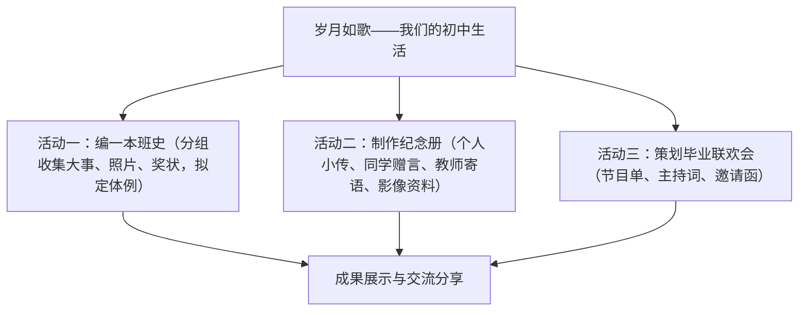

# 综合性学习：岁月如歌——我们的初中生活

标签：#综合性学习 #活动 #毕业纪念

## 一、活动目标

1. 回顾三年初中生活，收集整理成长足迹，学会用多种形式表达情感；
2. 在编写班史、制作纪念册、策划毕业晚会中锻炼搜集资料、组织协调、口语交际与写作能力；
3. 增进同学情谊、师生情谊，以积极心态面对毕业与升学。

## 二、活动内容与步骤

1. **筹备阶段**：全班分组（资料组、编辑组、文艺组），明确分工与时间表；
2. **实施阶段**：采访老师同学、整理三年大事记、征集文稿照片、排练节目；
3. **展示阶段**：班史发布、纪念册赠阅、联欢会演出；
4. **总结阶段**：撰写活动感想，评选优秀成果。

## 三、技法要点

1. **班史编写**：按时间顺序或专题（学习篇、活动篇、师恩篇）组织；大事记语言简洁准确，注明时间地点人物。
2. **赠言写作**：真诚得体，因人而异，可引用诗文名句，忌空话套话与调侃过度。
3. **主持词写作**：开场白要有感染力，串词要自然衔接节目，结束语呼应主题"岁月如歌"。
4. **邀请函格式**：标题、称呼、正文（时间、地点、事由）、落款，语言恳切礼貌。

## 四、常见问题

1. 分工不明，资料收集杂乱无序；
2. 赠言千篇一律，缺乏针对性与真情；
3. 主持词与节目脱节，串联生硬；
4. 只重形式热闹，忽视文字成果的积累与修改。

## 五、实践练习

1. 为班史写一则 150 字左右的"卷首语"，点明"岁月如歌"的主题。
2. 给你最想感谢的一位老师写一段 100 字的毕业赠言。
3. 拟写毕业联欢会开场白与结束语各一段。
4. 以"我的初中生活关键词"为题，选三个词写一篇 600 字随笔。

## 六、知识联系

- 赠言、随笔的立意提炼可运用[[写作：审题立意]]的方法；
- 班史、纪念册的栏目安排可借鉴[[写作：布局谋篇]]；
- 联欢会节目可排演课本剧，与[[任务二 准备与排练]]衔接；
- 回忆性文字的细节描写可参考[[5 孔乙己]]中人物刻画的手法。
