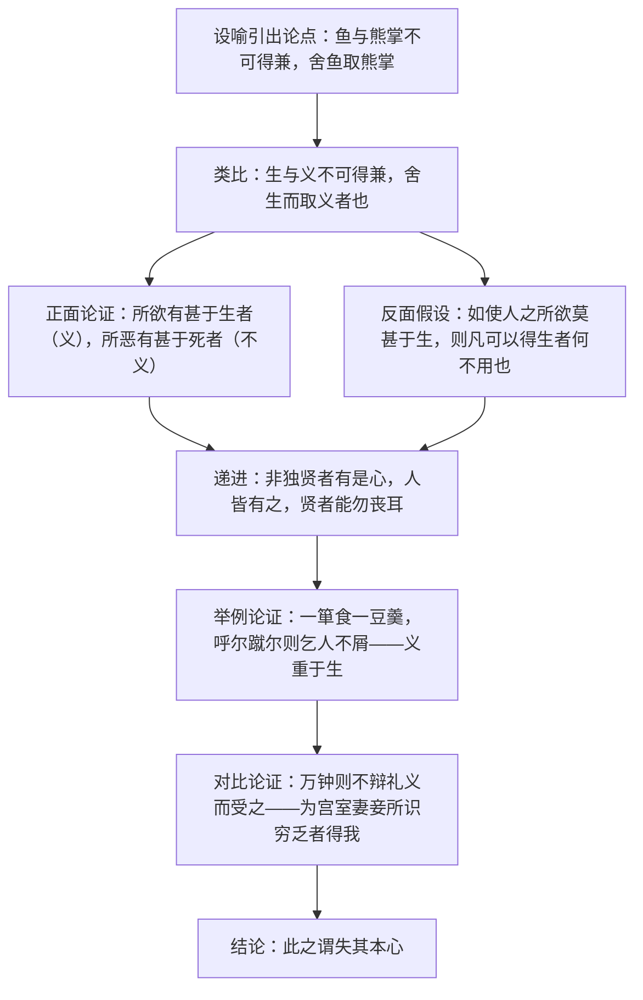

# 9 鱼我所欲也

标签：#文言文 #孟子 #中考必考

## 一、文学常识

- 出处：《孟子·告子上》。孟子（约前 372—前 289），名轲，战国时期思想家，儒家学派代表人物，被尊为"亚圣"，主张"性善论"与"仁政"。
- 《孟子》：孟子及其弟子共同编著，记录孟子的言行，长于论辩，气势充沛，善用比喻和排比。
- 文体：议论性散文，论述"舍生取义"的人生抉择。

## 二、字词积累

### 重点实词虚词

- **苟得**：苟且取得，指苟且偷生。
- **患**：祸患，灾难。**辟**：同"避"，躲避（通假字）。
- **如使**：假如，假使。**由是**：通过这种方法。
- **是故**：因此。**勿丧**：不丢掉。
- **箪**（dān）：古代盛饭用的圆竹器。**豆**：古代盛食物的器具（古今异义）。
- **呼尔而与之**：没有礼貌地吆喝着给他。**蹴**（cù）：踩踏。
- **不屑**：认为不值得，表示轻视而不肯接受。
- **万钟**：优厚的俸禄。**辩**：同"辨"，辨别（通假字）。
- **何加**：有什么益处。**奉**：侍奉。
- **得**：同"德"，感恩、感激（通假字）。**与**：同"欤"，语气词（通假字）。
- **乡**：同"向"，先前、从前（通假字）。**已**：停止。
- **本心**：本性，指人固有的羞恶之心。

## 三、论证思路

## 四、重点句翻译

1. 生，亦我所欲也；义，亦我所欲也。二者不可得兼，舍生而取义者也。——生命是我想要的，道义也是我想要的；两者不能同时得到，就舍弃生命而选取道义。
2. 非独贤者有是心也，人皆有之，贤者能勿丧耳。——不只是贤人有这种心，人人都有，只是贤人能够不丧失罢了。
3. 呼尔而与之，行道之人弗受；蹴尔而与之，乞人不屑也。——吆喝着给他，过路的饥民也不肯接受；踩踏过再给他，乞丐也不屑接受。
4. 万钟则不辩礼义而受之，万钟于我何加焉！——优厚的俸禄如果不辨别是否合乎礼义就接受，那对我有什么益处呢！
5. 此之谓失其本心。——这就叫作丧失了人固有的羞恶之心。

## 五、主题思想

文章以"鱼与熊掌"设喻，提出"舍生取义"的中心论点，论证了义重于生、义重于利，告诫人们要保有"本心"，不为利禄所诱，不失羞恶之心。

## 六、写作特色

1. 比喻论证开篇，化抽象为具体，深入浅出；
2. 正反对比、举例论证结合，逻辑严密；
3. 排比句式（"乡为身死而不受……"）气势磅礴，具有雄辩色彩。

## 七、练习题

1. 解释：苟得、蹴、万钟、本心；指出"辟""得""乡"的通假情况。
2. 翻译："二者不可得兼，舍生而取义者也。"
3. 本文的中心论点是什么？开头设喻有什么作用？
4. "一箪食，一豆羹"的例子论证了什么道理？

## 八、知识联系

- "舍生取义"精神与[[2* 梅岭三章]]"取义成仁今日事"直接呼应；
- 与[[10* 唐雎不辱使命]]中唐雎凛然赴义的行为互证；
- 与[[11 送东阳马生序]]同为中考文言重点，实词虚词须对比积累；
- 比喻论证、对比论证的方法可用于[[写作：布局谋篇]]中议论文训练。
