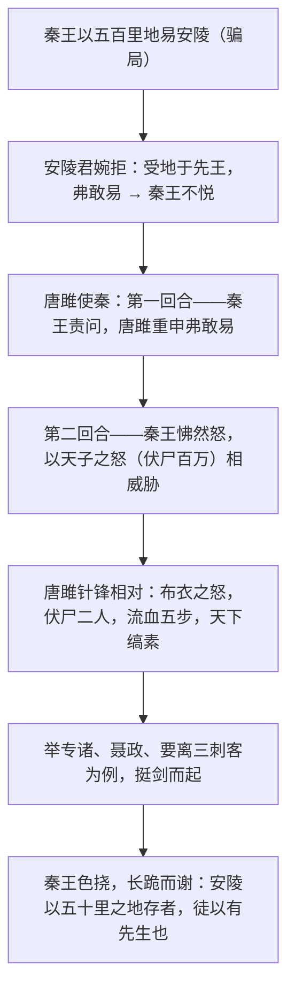

# 10* 唐雎不辱使命

标签：#文言文 #战国策 #中考重点

## 一、文学常识

- 出处：《战国策·魏策四》。《战国策》是西汉刘向根据战国史书整理编辑的国别体史书，共三十三篇，长于记述策士游说言辞。
- 背景：秦灭韩亡魏后，安陵国（魏的附庸小国）危在旦夕。秦王嬴政以"易地"为名企图吞并安陵，安陵君派唐雎出使秦国。
- 文体：史传散文，以人物对话展开矛盾冲突。"不辱使命"指没有辜负出使的任务。

## 二、字词积累

### 重点实词虚词

- **易**：交换。**其**（安陵君其许寡人）：加重语气的助词，可译"可要"。
- **加惠**：施与恩惠。**弗**：不。
- **错意**：在意。"错"同"措"，安放（通假字）。
- **请广于君**：让安陵君扩大领土。**广**：增广、扩充。
- **逆**：违背。**轻**：轻视。
- **虽然**：即使这样（古今异义）。**怫然**（fú）：愤怒的样子。
- **公**：对人的敬称。**布衣**：平民（借代）。
- **免冠徒跣**（xiǎn）：摘下帽子，光着脚。**抢地**（qiāng）：碰地、撞地。
- **休祲**（jìn）：吉凶的征兆。休：吉祥。祲：不祥。
- **缟素**（gǎo sù）：白色丧服，指穿丧服。
- **色挠**：神色变得沮丧。**谢**：道歉（古今异义）。**谕**：明白，懂得。

## 三、情节与人物

## 四、重点句翻译

1. 以君为长者，故不错意也。——（我）把安陵君看作忠厚长者，所以不打他的主意。
2. 虽千里不敢易也，岂直五百里哉？——即使是千里土地也不敢交换，何况仅仅五百里呢？
3. 布衣之怒，亦免冠徒跣，以头抢地耳。——平民发怒，也不过是摘掉帽子光着脚，用头撞地罢了。
4. 若士必怒，伏尸二人，流血五步，天下缟素，今日是也。——如果有志之士真的发怒，倒下的尸体只有两具，血只流五步远，可是天下人都要穿丧服，今天就是这样。
5. 安陵以五十里之地存者，徒以有先生也。——安陵国凭五十里土地能够保存下来，只是因为有先生您啊。

## 五、主题思想

文章记叙唐雎出使秦国、面对强暴针锋相对的经过，歌颂了他不畏强权、敢于斗争、机智勇敢的精神，也揭露了秦王骄横欺诈、外强中干的本质。

## 六、写作特色

1. 全文以对话塑造人物，言为心声，个性鲜明；
2. 对比映衬：秦王前倨后恭，唐雎先柔后刚；
3. 情节跌宕，矛盾冲突层层升级，富于戏剧性。

## 七、练习题

1. 解释：易、错意、抢地、休祲、色挠、谢。
2. 翻译："虽千里不敢易也，岂直五百里哉？"
3. 秦王的态度经历了怎样的变化？说明了什么？
4. 唐雎列举专诸、聂政、要离的事例有什么作用？

## 八、知识联系

- 唐雎凛然赴义与[[9 鱼我所欲也]]"舍生取义"的主张互为注脚；
- 与[[11 送东阳马生序]]同为本单元文言篇目，注意"谢""虽"等词义辨析；
- 人物对话推动冲突的写法可与[[6 变色龙]]、[[17 屈原（节选）]]比较；
- 外交辞令的锋芒可为[[口语交际：辩论]]提供借鉴。
