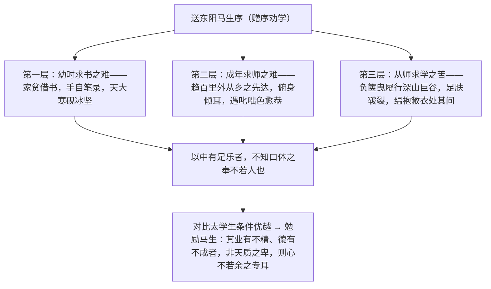

# 11 送东阳马生序

标签：#文言文 #宋濂 #中考必考

## 一、文学常识

- 作者：宋濂（1310—1381），字景濂，号潜溪，明初文学家，被朱元璋誉为"开国文臣之首"，与刘基、高启并称"明初诗文三大家"。
- 背景：洪武十一年（1378），宋濂告老还乡后入朝觐见，同乡晚辈太学生马君则（东阳人）前来拜访，宋濂写此赠序勉励他勤奋学习。
- 文体："序"分书序与赠序，本文是**赠序**——临别赠言性质的文体，多为勉励、推崇、赞许之辞。

## 二、字词积累

### 重点实词虚词

- **嗜学**（shì）：爱好学习。**致**：得到。
- **假借**：借。**弗之怠**：即"弗怠之"，不懈怠（宾语前置）。
- **走**：跑（古今异义）。**逾约**：超过约定期限。
- **既加冠**（guān）：成年之后。古代男子二十岁行加冠礼。
- **硕师**：学问渊博的老师。**叩问**：请教。
- **德隆望尊**：道德声望高。**稍降辞色**：把言辞放委婉些，把脸色放温和些。
- **援疑质理**：提出疑难，询问道理。**叱咄**（chì duō）：训斥，呵责。
- **俟**（sì）：等待。**负箧曳屣**（qiè xǐ）：背着书箱，拖着鞋子。
- **皲裂**（jūn）：皮肤因寒冷干燥而开裂。**媵人**（yìng）：侍婢，这里指旅舍中的仆役。
- **汤**：热水（古今异义）。**衾**（qīn）：被子。
- **寓逆旅**：寄居在旅店。**容臭**（xiù）：香袋。臭：气味。
- **烨然**（yè）：光彩照人的样子。**缊袍敝衣**（yùn）：破旧的衣服。
- **口体之奉**：吃的穿的。**耄老**（mào）：年老。**廪稍**（lǐn）：官府发的粮食。

## 三、结构层次

## 四、重点句翻译

1. 家贫，无从致书以观，每假借于藏书之家，手自笔录，计日以还。——家里穷，没有办法得到书来读，常常向有藏书的人家借，亲手抄录，计算着日期归还。
2. 天大寒，砚冰坚，手指不可屈伸，弗之怠。——天气非常寒冷，砚池里的水结成坚冰，手指冻得不能屈伸，也不放松抄书。
3. 故余虽愚，卒获有所闻。——所以我虽然愚笨，最终还是有所收获。
4. 以中有足乐者，不知口体之奉不若人也。——因为内心有足以快乐的事（读书），不觉得吃的穿的不如别人。
5. 其业有不精、德有不成者，非天质之卑，则心不若余之专耳。——他们如果学业不精通、品德没养成，不是天资低下，而是用心不如我专一罢了。

## 五、主题思想

作者现身说法，叙述自己青少年时期借书、求师、求学的种种艰难和以苦为乐的专一态度，与太学生优越的条件对比，勉励马生（及后学）珍惜条件、勤奋专心地学习。

## 六、写作特色

1. 现身说法，以叙代议，真切感人；
2. 对比手法贯穿全文：昔日之苦与今日太学之优、同舍生"烨然若神人"与"余则缊袍敝衣"；
3. 细节描写生动（砚冰坚、足肤皲裂），语言质朴恳切。

## 七、练习题

1. 解释：假借、走、汤、援疑质理、缊袍敝衣。
2. 翻译："以中有足乐者，不知口体之奉不若人也。"
3. 作者从哪几个方面写自己求学的艰难？
4. 文中的对比有什么作用？对你的学习有何启示？

## 八、知识联系

- 与[[9 鱼我所欲也]][[10* 唐雎不辱使命]]同为中考文言重点，注意一词多义整理；
- 劝学主题可与[[名著导读：《儒林外史》]]中读书人的功利心态对照反思；
- "赠序"文体知识常考，注意与"书序"区分；
- 昔今对比的结构可借鉴于[[写作：布局谋篇]]。
