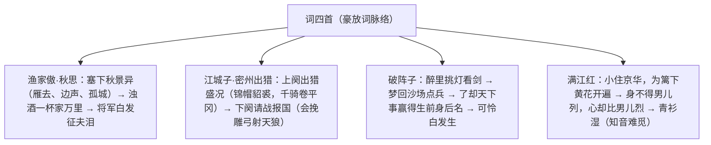

# 12 词四首

标签：#古诗词 #豪放词 #中考必背

## 一、文学常识

- 《渔家傲·秋思》：范仲淹，北宋政治家、文学家；写于其任陕西经略副使镇守西北边塞时，开宋代豪放词先声。
- 《江城子·密州出猎》：苏轼，字子瞻，号东坡居士，"唐宋八大家"之一；写于任密州知州时，是其早期豪放词代表作。
- 《破阵子·为陈同甫赋壮词以寄之》：辛弃疾，字幼安，号稼轩，南宋爱国词人，与苏轼并称"苏辛"；写给志同道合的友人陈亮（字同甫）。
- 《满江红》（小住京华）：秋瑾，号鉴湖女侠，近代民主革命志士；写于 1903 年中秋，抒冲破家庭牢笼、投身革命的抱负。

## 二、字词积累

- **塞下**（sài）：边界要塞之地。**衡阳雁去**：雁去衡阳（倒装）。
- **燕然未勒**（lè）：指战事未平、功名未立（用窦宪刻石燕然山典故）。
- **聊**：姑且。**擎**（qíng）：举着。**貂裘**（diāo qiú）：貂皮衣服。
- **会挽雕弓**：会，终将；雕弓，饰以彩绘的弓。**天狼**：星名，喻指侵扰西北的西夏。
- **麾下**（huī）：军旗之下，指部下。**的卢**（dí lú）：一种烈性快马。
- **霹雳**（pī lì）：响声巨大的强雷，喻弓弦声。
- **八千里路云和月**……注：此为岳飞句；秋瑾词中——**四面歌残终破楚**：用四面楚歌典故喻列强逼迫、国势危殆。
- **青衫湿**：用白居易"江州司马青衫湿"典故，喻知音难觅之悲。

## 三、结构脉络

## 四、名句赏析与翻译

1. "浊酒一杯家万里，燕然未勒归无计"：一杯浊酒难消万里乡愁，战功未建无法还乡——思乡与报国的矛盾，苍凉悲壮。
2. "会挽雕弓如满月，西北望，射天狼"：终将把雕弓拉得如满月，朝西北方瞄望，射下天狼星——用天狼星喻西夏，抒杀敌报国的豪情。
3. "了却君王天下事，赢得生前身后名。可怜白发生"：完成收复失地的大业，博得生前身后的美名；可叹壮志未酬白发已生——"可怜"陡转，理想与现实的巨大落差令人扼腕。
4. "身不得，男儿列，心却比，男儿烈"：身不在男儿行列，心却比男儿刚烈——短句急促，写出冲破封建束缚的英气。
5. "八百里分麾下炙，五十弦翻塞外声"：把烤牛肉分给部下，乐器奏起塞外军歌——视听结合，再现军营的雄豪气氛。

## 五、主题思想

四首词均属豪放风格：范词写边塞将士思乡与报国之情；苏词抒渴望驰骋疆场、为国御敌的豪情；辛词写壮志难酬的悲愤；秋瑾词抒巾帼不让须眉的革命抱负——共同展现家国情怀。

## 六、写作特色

1. 用典精当：燕然勒功、遣冯唐、射天狼、四面楚歌、青衫湿；
2. 虚实结合：辛词梦境（虚）与"白发生"（实）对照，落差成悲；
3. 意象雄浑：孤城落日、雕弓满月、沙场秋点兵；
4. 情感跌宕，结句往往力重千钧。

## 七、练习题

1. 默写："会挽雕弓如满月"前后句、"了却君王天下事"一联。
2. "千嶂里，长烟落日孤城闭"描绘了怎样的画面？
3. 《破阵子》中"可怜白发生"在结构与情感上有什么作用？
4. 比较四首词在题材与情感上的异同。

## 八、知识联系

- 与[[课外古诗词诵读]]（定风波、太常引等）同为宋词，可系统梳理苏辛词风；
- 范仲淹的家国情怀可联系九上《岳阳楼记》"先忧后乐"；
- 秋瑾的英气与[[2* 梅岭三章]]的革命豪情相通；
- 用典手法的鉴赏方法可迁移至[[10* 唐雎不辱使命]]中的人物用例。
