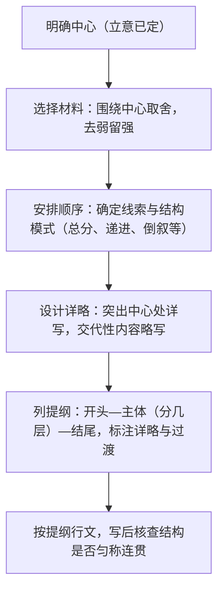

# 写作：布局谋篇

标签：#写作 #结构 #技法

## 一、技法要点

1. **布局谋篇**：在确定立意之后，通盘考虑文章的整体结构——先写什么、后写什么、详写什么、略写什么，使文章条理清晰、层次分明。
2. **常见结构模式**：
   - 记叙文：时间顺序、空间顺序、事件发展顺序、倒叙设悬、插叙补充；
   - 议论文：总分总、并列式、递进式、对照式；
   - 一线串珠：以某一物件、情感或场景为线索贯穿全文。
3. **开头与结尾**：开头要引人（开门见山、设置悬念、场景切入），结尾要有力（卒章显志、呼应开头、余味悠长）。
4. **过渡与照应**：段落间用过渡句衔接，前有伏笔后有照应，使结构严密。

## 二、步骤方法

- 列提纲是布局谋篇的核心操作：每层写一句概括，注明所用材料与预计字数；
- 记叙文可设计"波澜"：欲扬先抑、悬念、误会、突转；
- 议论文分论点排列要有逻辑（由浅入深、由个人到社会）。

## 三、常见问题

1. **结构失衡**：开头冗长、主体单薄、结尾仓促（"虎头蛇尾"）；
2. **平铺直叙**：记流水账，无波澜、无详略；
3. **段落混杂**：一段包含几层意思，或几段重复一个意思；
4. **缺少过渡**：层次之间跳跃生硬，缺乏衔接与照应；
5. **提纲虚设**：写作时随意偏离提纲，结构走形。

## 四、实践练习

1. 以"那一刻，我长大了"为题列出两种不同结构的提纲（顺叙式与倒叙式），比较优劣。
2. 给议论文"谈坚持"设计三个分论点，分别按并列式与递进式排列，体会差异。
3. 找出自己上一篇作文的结构问题，重新列提纲并调整详略。
4. 分析《送东阳马生序》"昔日之苦—今日之优—勉励后学"的布局，借鉴其对比谋篇。

## 五、北京中考提示

- 中考记叙文阅卷首先看结构是否完整清晰，建议 5—7 段，重点段落集中笔墨；
- 情境写作（如演讲稿、书信）须按文体固定格式布局，不可缺项。

## 六、知识联系

- 布局谋篇以[[写作：审题立意]]为前提，意在笔先；
- 议论文的层次安排可参考[[9 鱼我所欲也]]的论证结构与[[13 短文两篇]]的论述思路；
- 成文后的调整打磨衔接[[写作：修改润色]]；
- 名著中回目式结构可见[[名著导读：《儒林外史》]]。
