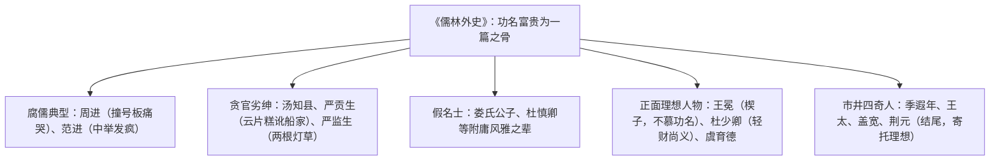

# 名著导读：《儒林外史》

标签：#名著 #讽刺小说 #中考考点

## 一、作品概况

- 作者：吴敬梓（1701—1754），字敏轩，号粒民，晚号文木老人，安徽全椒人，清代小说家。
- 体裁：我国古代**讽刺小说的高峰**，长篇章回体，共五十六回，成书于清乾隆年间。
- 内容：以写实主义描绘科举制度下"儒林"群像，刻画各类士人面对"功名富贵"的不同表现，无贯穿全书的中心人物与情节，由多个相对独立的故事连缀而成。
- 鲁迅评价："秉持公心，指摘时弊……戚而能谐，婉而多讽。"

## 二、主要人物与情节

- **周进**：六十多岁仍是童生，观贡院撞号板痛哭，众商人捐钱替他捐监生，后中举中进士。
- **范进**：五十四岁中秀才，中举后欢喜得发了疯，被丈人胡屠户一巴掌打醒。
- **严监生**：临死因灯盏里点了两根灯草不肯咽气，是吝啬鬼的典型。
- **匡超人**：由淳朴孝子逐步堕落为吹牛撒谎、忘恩负义的势利之徒，展示科举社会对人的腐蚀过程。
- **杜少卿**：淡泊功名、傲视权贵、扶危济困，带有作者自况色彩。

## 三、艺术特色

1. **讽刺艺术**：不加断语，让人物言行自相矛盾而现出原形（如严贡生声称"从不晓得占人寸丝半粟的便宜"，话音未落便强圈邻家的猪）；
2. 夸张而不失真：范进发疯、严监生两根灯草，夸张中见真实；
3. 结构独特："虽云长篇，颇同短制"，人物依次登场又退场；
4. 对比手法：同一人物前后对比（胡屠户对范进前倨后恭）、不同人物互相映照。

## 四、主题思想

全书以"功名富贵"为中心，揭露科举制度对士人心灵的毒害与社会风气的败坏，讽刺贪官污吏、腐儒假名士，同时通过王冕、杜少卿等寄托了作者对理想人格的追求。

## 五、中考考点

1. 作者朝代、体裁地位（清代讽刺小说高峰）；
2. 主要人物及对应情节的识记与匹配（周进哭号板、范进中举、严监生两根灯草、匡超人堕落）；
3. 讽刺手法的具体分析（结合语段辨析夸张、对比、白描）；
4. 结合课文《范进中举》分析胡屠户、张乡绅等人物形象；
5. 探究专题：故事会、讽刺艺术欣赏、续写故事。

## 六、练习题

1. 简述范进中举后众人态度的变化，说明其讽刺意义。
2. 严监生和严贡生兄弟二人各有什么典型情节？各讽刺了什么？
3. 举例说明《儒林外史》"婉而多讽"的特点。
4. 王冕在全书结构中有什么作用？

## 七、知识联系

- 课文[[21 范进中举]]即选自本书，须结合精读；
- 与[[5 孔乙己]]同写科举牺牲品，可比较古今讽刺笔法；
- 与[[名著导读：《水浒传》]]同为章回体，结构方式迥异，可对照；
- 讽刺性细节的运用可启发[[写作：有创意地表达]]。
