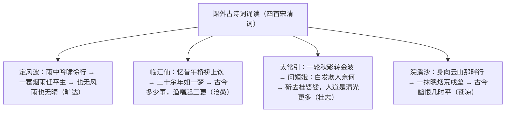

# 课外古诗词诵读

标签：#古诗词 #宋词 #诵读积累

## 一、篇目与文学常识

- 《定风波》（莫听穿林打叶声）：苏轼，写于贬谪黄州期间，沙湖道中遇雨，同行皆狼狈而己独不觉，借途中风雨抒旷达襟怀。
- 《临江仙·夜登小阁，忆洛中旧游》：陈与义，南宋初诗人；靖康之难后流寓南方，夜登小阁追忆二十余年前洛中旧游，抚今追昔。
- 《太常引·建康中秋夜为吕叔潜赋》：辛弃疾，中秋夜咏月抒怀，借神话表达扫清阴霾、恢复中原的理想。
- 《浣溪沙》（身向云山那畔行）：纳兰性德，清代词人；随驾出塞时所作，写北方边塞深秋景象与吊古之情。

## 二、结构脉络

## 三、名句赏析

1. "莫听穿林打叶声，何妨吟啸且徐行"："莫听""何妨"见出不为外物所扰的从容；风雨既是自然风雨，也暗喻政治风雨。
2. "回首向来萧瑟处，归去，也无风雨也无晴"：晴雨皆忘，宠辱不惊，是全词主旨所在，体现苏轼超然物外的人生境界。
3. "二十余年如一梦，此身虽在堪惊"：二十多年恍如一梦，此身虽存却心有余悸——浓缩了靖康之变后士人的家国之痛。
4. "杏花疏影里，吹笛到天明"：以疏影、笛声的清雅画面写旧游之乐，与今日漂泊对照，乐景衬哀情。
5. "斫去桂婆娑，人道是，清光更多"：要砍去月中摇曳的桂树，让清光洒满人间——隐喻扫除投降势力与金人统治，恢复中原。
6. "一抹晚烟荒戍垒，半竿斜日旧关城"：晚烟、荒垒、斜日、旧城，意象叠加，绘出边塞荒凉，引出"古今幽恨"。

## 四、主题思想

四首词分别抒写旷达超脱（苏轼）、忆旧伤时（陈与义）、报国壮志（辛弃疾）、边塞幽恨（纳兰性德），情感各异而都由眼前之景引向深沉的人生与家国之思。

## 五、诵读与积累要点

1. 把握词牌与题目关系：词牌定格律，题目（小序）点内容；
2. 抓"词眼"："任平生""如一梦""清光更多""幽恨"分别是四首词的情感落点；
3. 背诵默写为北京中考基础题必考范围，注意"蓑""姮娥""斫""戍垒"等易错字。

## 六、练习题

1. 默写："回首向来萧瑟处"三句、"杏花疏影里"两句。
2. 《定风波》中"风雨"有哪两层含义？
3. 《太常引》如何借神话传说表达政治理想？
4. 比较苏轼与辛弃疾两首词情感基调的差异。

## 七、知识联系

- 与[[12 词四首]]同为词作，苏轼、辛弃疾两家可对照其豪放与旷达的不同面向；
- 陈与义的家国之痛可联系[[课外古诗词诵读]]（ch6：南安军等）中的亡国之悲；
- 词的意象鉴赏方法可迁移至[[3* 短诗五首]]的新诗意象分析；
- 名句化用可丰富[[写作：修改润色]]中的语言升格。
