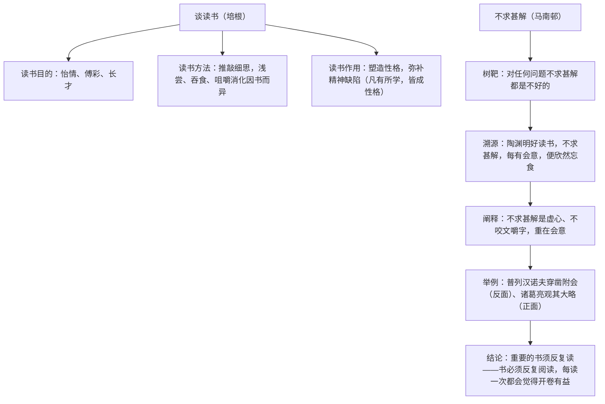

# 13 短文两篇

标签：#议论文 #读书 #驳论

## 一、文学常识

- 《谈读书》：培根（1561—1626），英国哲学家、作家，"知识就是力量"的提出者，著有《随笔》。本文译者王佐良，译文半文半白，典雅凝练。
- 《不求甚解》：马南邨（cūn），原名邓拓，当代作家、历史学家，本文选自杂文集《燕山夜话》。
- 文体：《谈读书》为立论性随笔；《不求甚解》为**驳论文**——先树靶子（对方观点），再逐层批驳并阐明己见。

## 二、字词积累

- **怡情**（yí）：使心情愉快。**傅彩**：着色，指给言辞增添光彩。
- **文采藻饰**：修饰文辞，使之富有文采。**诘难**（jié nàn）：诘问，为难。
- **寻章摘句**：搜寻摘取文章的片段词句，指读书局限于文字推求。
- **味同嚼蜡**（jiáo）：形容写文章或说话枯燥无味。
- **吹毛求疵**（cī）：刻意挑剔毛病，寻找差错。
- **狂妄自大**：极端的自高自大。**咬文嚼字**：过分地斟酌字句。
- **豁然贯通**（huò）：一下子明白了某个道理。
- **不求甚解**：原指读书只求领会要旨，不刻意在字句上下功夫；今多指学习不认真、不求深入理解（古今义变化正是文章辨析的起点）。

## 三、论证思路

## 四、语句赏析

1. "读史使人明智，读诗使人灵秀，数学使人周密……"：排比列举各学科功用，句式整齐，概括精辟，是名言积累重点。
2. "书有可浅尝者，有可吞食者，少数则须咀嚼消化"：比喻论证，把不同读法喻为不同吃法，生动贴切。
3. 《不求甚解》引陶渊明原文并还原语境，指出断章取义之误——体现驳论文"先破后立"的思路。
4. "观其大略"与"务于精熟"对举：诸葛亮读书例证说明大处着眼往往比死抠字句收获更大。

## 五、主题思想

《谈读书》围绕读书的目的、方法、作用展开，倡导读书与经验互补、因书择法；《不求甚解》批驳对"不求甚解"的曲解，主张读书要虚心、重会意、反复读。两文互补，共论科学的读书观。

## 六、写作特色

1. 《谈读书》：警句迭出，比喻、排比、对比论证兼施，说理透彻；
2. 《不求甚解》：驳论典范——引用论证、举例论证、正反对比，逐层递进；
3. 两文语言一典雅一平易，可比较随笔与杂文的风格差异。

## 七、练习题

1. 《谈读书》从哪三个方面谈读书？各用了什么论证方法？
2. 《不求甚解》批驳的观点是什么？作者的观点是什么？
3. "不求甚解"在陶渊明原文中的含义是什么？
4. 结合自身实际，谈谈你对"读书须反复读"的理解。

## 八、知识联系

- 驳论思路可用于[[口语交际：辩论]]中的反驳环节；
- 论证方法辨析与[[14 山水画的意境]][[15* 无言之美]]同属本单元议论文阅读重点；
- 读书方法可指导[[名著导读：《儒林外史》]]的整本书阅读；
- 立论布局可迁移到[[写作：布局谋篇]]。
