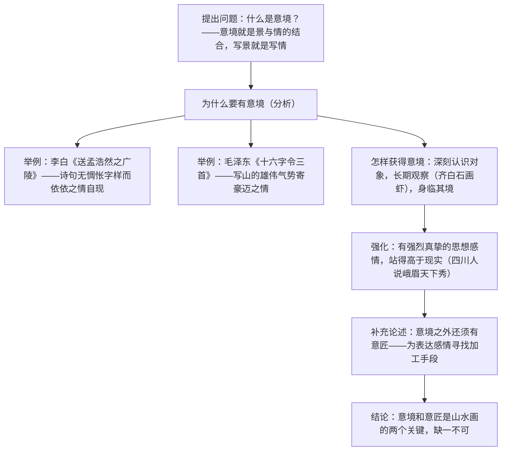

# 14 山水画的意境

标签：#议论文 #文艺论 #李可染

## 一、文学常识

- 作者：李可染（1907—1989），江苏徐州人，现代著名画家，齐白石弟子，以山水画成就最高，代表画作《万山红遍》《漓江胜境图》。
- 选文：节选自《漫谈山水画》，是一篇讨论山水画创作核心问题的文艺论文（事理性议论文）。
- 核心概念：**意境**——景与情的结合；**意匠**——表现意境的加工手段（构图、笔墨等艺术处理）。

## 二、字词积累

- **惆怅**（chóu chàng）：伤感，失意。
- **真挚**（zhì）：真诚恳切（多指感情）。
- **渲染**（xuàn）：国画技法，用水墨或淡彩涂染画面以加强效果；喻夸大地形容。
- **身临其境**：亲身面临那种境地。
- **胸有成竹**：比喻做事之前已有通盘考虑（源于文与可画竹典故）。
- **朝朝暮暮**：从早到晚，天天如此。
- **浮光掠影**：比喻印象不深刻，观察不细致。
- **金碧辉煌**：形容建筑物等异常华丽，光彩夺目。

## 三、论证思路

## 四、语句赏析

1. "意境就是景与情的结合；写景就是写情"：开篇下定义，简明扼要地揭示全文核心概念。
2. 以李白诗为例："帆已经远去……他还立在江边遥望"——用诗歌意境类比绘画意境，说明艺术门类相通，例证亲切可感。
3. "一棵树、一座山，观其精神实质……一位作者，对着一棵松树画了一百多张"：举例论证"长期观察、深入全面认识"是获得意境的前提。
4. "有的画家，没有深刻感受，没有表达自己亲身感受的强烈欲望……说明他的意境不深"：从反面论证真挚感情之必要。

## 五、主题思想

文章围绕"意境"阐述：意境是景与情的结合，是山水画的灵魂；获得意境要深入观察、有真挚强烈的感情；意境还须借助意匠才能传达——揭示了艺术创作情、景、技相统一的规律。

## 六、写作特色

1. 概念界定清晰，按"是什么—为什么—怎么样"的思路层层推进；
2. 举例论证丰富且多跨门类（诗歌、绘画），以熟悉喻陌生；
3. 语言平易亲切，以画家身份现身说法，有说服力。

## 七、练习题

1. 什么是"意境"？什么是"意匠"？二者是什么关系？
2. 作者为什么要以李白、毛泽东的诗为例来谈山水画？
3. 怎样才能获得意境？请分条概括。
4. 结合一首你熟悉的写景诗，分析其意境。

## 八、知识联系

- 与[[15* 无言之美]][[16* 驱遣我们的想象]]同属文艺论文单元，"意境""留白""想象"概念互通；
- "景与情的结合"可用于[[12 词四首]]的借景抒情赏析；
- "是什么—为什么—怎么样"结构是[[写作：布局谋篇]]的议论文范式；
- 与[[13 短文两篇（谈读书 不求甚解）]]比较举例论证的不同用法。
