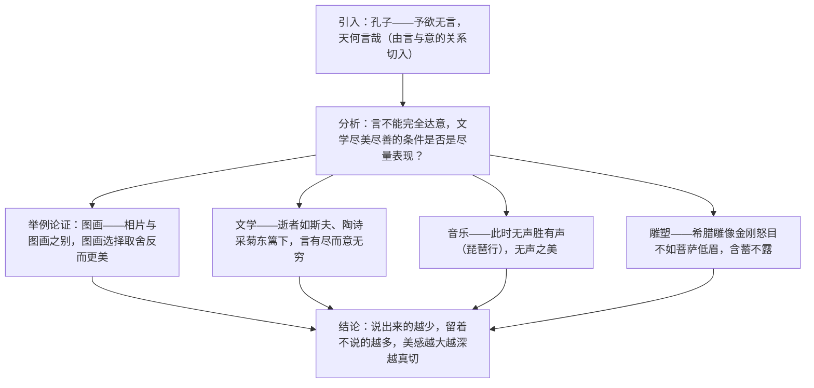

# 15* 无言之美

标签：#议论文 #美学 #朱光潜

## 一、文学常识

- 作者：朱光潜（1897—1986），安徽桐城人，现代美学家、翻译家，中国现代美学奠基人之一，代表作《谈美》《西方美学史》《给青年的十二封信》。
- 选文：节选自《朱光潜全集》，是一篇谈美学问题的文艺论文。
- 核心观点：说出来的越少，留着不说的越多，所引起的美感就越大越深越真切——即"无言之美"。

## 二、字词积累

- **意蕴**（yùn）：内在的意义，含义。
- **附丽**：附着，依附。
- **姑且**：表示暂时地。**笼统**：缺乏具体分析，不明确。
- **蛾眉**（é）：形容女子细长而弯的眉毛。
- **寂寥**（liáo）：寂静空旷。
- **谚语**（yàn）：民间流传的固定语句。
- **心旷神怡**：心境开阔，精神愉快。
- **轻描淡写**：着力不多地描写或叙述，谈问题时把重要问题轻轻带过。
- **栩栩如生**（xǔ）：形容艺术形象非常逼真，如同活的一样。
- **信手拈来**（niān）：随手拿来，形容写文章时词汇或材料丰富，不费思索。

## 三、论证思路

## 四、语句赏析

1. 由孔子"予欲无言"引出话题：借圣人言行设疑，自然引人思考"无言"的意蕴。
2. "言所以达意，然而意决不是完全可以言达的"：指出语言与意念的固有矛盾，是全文立论的逻辑起点。
3. "与其尽量流露，不如稍有含蓄；与其吐肚子把一切都说出来，不如留一大部分让欣赏者自己去领会"：对比句式点明含蓄之妙，欣赏者的再创造正是美感来源。
4. 举"此时无声胜有声"论音乐的无言之美：引用白居易诗句，以听觉艺术印证观点，例证跨越多个艺术门类。

## 五、主题思想

文章从言意关系入手，通过图画、文学、音乐、雕塑等多领域实例，论证了艺术表达宜含蓄留白的道理——"无言之美"启示我们欣赏艺术要驱遣想象、体味言外之意。

## 六、写作特色

1. 例证广博：绘画、诗文、音乐、雕刻多门类互证，说服力强；
2. 讲道理与摆事实结合，层层追问，思辨色彩浓；
3. 语言亲切自然，深入浅出，体现美学随笔风格。

## 七、练习题

1. 本文的中心论点是什么？作者是怎样一步步推出的？
2. 作者列举了哪些艺术门类的例子？各证明了什么？
3. 结合"采菊东篱下，悠然见南山"，谈谈你对"无言之美"的理解。
4. "拿美术来表现思想和情感，与其尽量流露，不如稍有含蓄"，你赞同吗？说明理由。

## 八、知识联系

- 与[[14 山水画的意境]]的"意境"、[[16* 驱遣我们的想象]]的"想象"构成本单元文艺理论三概念；
- "言有尽而意无穷"可用于[[课外古诗词诵读]]的诗词鉴赏；
- 含蓄留白的手法印证[[5 孔乙己]]结尾"大约的确"的艺术效果；
- 多门类举例的论证方式可借鉴到[[写作：布局谋篇]]。
