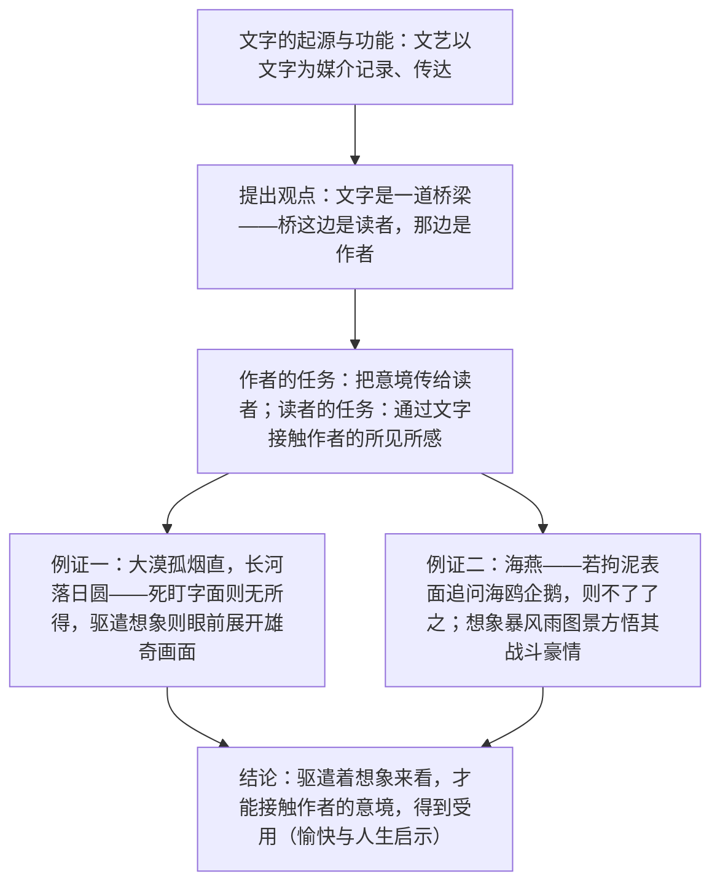

# 16* 驱遣我们的想象

标签：#议论文 #文艺论 #叶圣陶

## 一、文学常识

- 作者：叶圣陶（1894—1988），原名叶绍钧，江苏苏州人，现代作家、教育家、编辑家，有"优秀的语言艺术家"之称，代表作长篇小说《倪焕之》、童话集《稻草人》。
- 选文：出自《文艺作品的鉴赏》，是一篇指导文学鉴赏方法的文艺论文。
- 核心观点：欣赏文艺作品，要通过文字这座桥梁，驱遣想象，进入作者的意境，获得人生的受用。

## 二、字词积累

- **歌谣**（yáo）：随口唱出、没有音乐伴奏的韵语。
- **契合**（qì）：符合，合得来。
- **旷远**（kuàng）：空旷辽远。
- **海啸**（xiào）：由海底地震或风暴引起的海水剧烈波动。
- **苟安**：只顾眼前，暂且偷安。
- **拘泥**（jū nì）：固执，不知变通。
- **怅然**（chàng）：因不如意而感到不痛快。
- **鉴赏**：鉴定和欣赏（艺术品、文物等）。

## 三、论证思路

## 四、语句赏析

1. "文字是一道桥梁。这边的桥堍站着读者，那边的桥堍站着作者"：比喻论证，形象揭示文字在作者与读者之间的中介作用，是全文的枢纽句。
2. 王维诗例的正反对照：先写"死盯着文字"只做字面解释的错误读法，再写想象中"荒凉的大漠、一缕直升的炊烟"的画面，对比中彰显方法之别。
3. 《海燕》诗例："生活在这样的境界里，是愉快的，是酬报"——说明鉴赏的最终目的是获得审美愉悦与人生受用。
4. "必须驱遣我们的想象，才能够通过文字，达到这个目的"：卒章点题，与题目呼应，结论明确有力。

## 五、主题思想

文章阐明文艺鉴赏的基本方法：文字只是桥梁，读者须驱遣想象，透过文字再现作者的所见所感、进入作品意境，从而得到审美的愉快与人生的受用。

## 六、写作特色

1. 从文字起源谈起，由远及近，娓娓道来；
2. 正反对比举例（死抠字面 vs 驱遣想象），是非分明；
3. 所举王维诗、高尔基《海燕》皆为经典文本，例证典型；
4. 语言平实晓畅，体现叶圣陶"写话"风格。

## 七、练习题

1. 作者为什么说"文字是一道桥梁"？
2. 结合王维诗例，说说"驱遣想象"的具体做法。
3. 文中对《海燕》的解读给你怎样的启发？
4. 用"驱遣想象"的方法赏析"千嶂里，长烟落日孤城闭"。

## 八、知识联系

- 文中例证直接关联课文[[4 海燕]]，可回读印证；
- 与[[14 山水画的意境]][[15* 无言之美]]共同构成"意境—留白—想象"的鉴赏理论链；
- 想象再现画面的方法可用于[[12 词四首]]与[[课外古诗词诵读]]的画面描述题；
- 鉴赏心得的表达可练习[[写作：修改润色]]。
