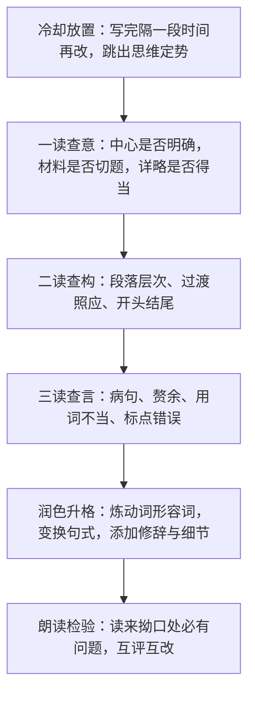

# 写作：修改润色

标签：#写作 #修改 #语言升格

## 一、技法要点

1. **修改**着眼于"正确"："言"（语言表达）与"意"（内容立意）两方面都要检查——观点是否正确、材料是否贴切、结构是否合理、语句是否通顺、标点是否规范。
2. **润色**着眼于"更好"：在正确的基础上使语言更准确、生动、有文采——炼字炼句、调整句式、增添修辞、化用诗文。
3. **修改顺序**：先整体后局部——先看立意结构（大处），再改段落衔接（中处），最后润饰词句标点（小处）。
4. 好文章是改出来的："文章不厌百回改"，修改是写作的重要环节而非附属。

## 二、步骤方法

- **删**：删去重复、空洞、离题的文字；
- **增**：补充具体细节，充实单薄之处；
- **调**：调整语序与段落顺序，使逻辑顺畅；
- **换**：以准确生动之词替换平淡笼统之词（"走"→"挪""踱""冲"）。

## 三、常见问题

1. 只改错别字，不动结构与立意，修改流于表面；
2. 润色堆砌辞藻，华而不实，反伤文意；
3. 舍不得删：与中心无关的"得意之笔"迟迟不肯割爱；
4. 缺少读者意识，不通过朗读、互评发现问题。

## 四、实践练习

1. 病文修改：给一段 200 字病文（含病句、赘余、详略不当），完成"删、增、调、换"四步修改并写出修改说明。
2. 炼字练习：将"太阳照在湖面上，很好看"扩改为有画面感的句子，比较三种改法。
3. 将自己上次作文的开头结尾各润色一遍，做到开头引人、结尾点题。
4. 同桌互改：用符号标注（波浪线佳句、横线病句），互写 50 字评语。

## 五、北京中考提示

- 中考语文基础运用板块常考病句辨析与修改，与本课直接相关；
- 作文一类文的重要标志是"语言准确流畅、有表现力"，日常须坚持自改互改。

## 六、知识联系

- 修改的前提是[[写作：审题立意]]准确、[[写作：布局谋篇]]合理，三者构成写作全程；
- 炼字可借鉴[[7* 溜索]]白描动词与[[5 孔乙己]]"排""摸"的用字艺术；
- 语言含蓄的分寸可参考[[15* 无言之美]]的留白理论；
- 润色后的个性表达通向[[写作：有创意地表达]]。
