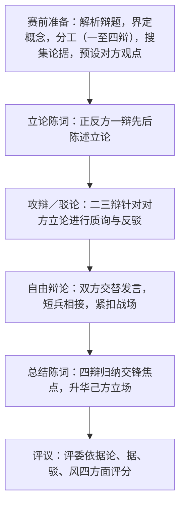

# 口语交际：辩论

标签：#口语交际 #辩论 #思辨

## 一、技法要点

1. **辩论的实质**：围绕有分歧的辩题，正反双方以事实和逻辑证明己方观点、反驳对方观点的口语交际活动；比的是观点、证据与逻辑，而非嗓门。
2. **立论**：明确界定辩题关键概念，确立清晰的总论点与二三个分论点，选取典型有力的论据。
3. **反驳**：抓对方要害——概念偷换、论据失实、推理漏洞、以偏概全；可用归谬法、反例法、引用法。
4. **辩风**：语言文明得体，尊重对手；表达简洁流畅，声音洪亮，善用停顿、反问增强气势。
5. **倾听与应变**：认真记录对方要点，快速捕捉漏洞，随机应变，不背稿硬套。

## 二、步骤方法（赛制流程）

- 准备阶段要"知己知彼"：为对方立场也写一份提纲，预演攻防；
- 自由辩论要守住"主战场"，不被枝节问题带偏；
- 总结陈词切忌重复念稿，应针对现场交锋作归纳。

## 三、常见问题

1. **跑题**：脱离辩题核心概念，各说各话；
2. **人身攻击**：驳"人"不驳"论"，辩风失当；
3. **论据薄弱**：只讲道理不举实例，或例子陈旧失实；
4. **不会倾听**：只顾背准备好的稿子，无法回应对方现场观点；
5. **概念不清**：己方对辩题关键词界定模糊，被对方牵着走。

## 四、实践练习

1. 辩题练习："中学生上网利大于弊／弊大于利"：各写立论提纲（总论点+三个分论点+论据）。
2. 反驳训练：针对"读书无用论"的三条论据，分别用反例法、归谬法写出反驳词。
3. 班级模拟辩论赛："人工智能对中学生学习利大于弊"，按四辩制完整流程进行并互评。
4. 观看一场辩论赛视频，记录双方交锋焦点，评析最佳辩手的技巧。

## 五、知识联系

- 反驳的思路可直接借鉴[[13 短文两篇]]中《不求甚解》的驳论方法；
- 立论的逻辑结构与[[写作：布局谋篇]]议论文谋篇一致；
- 唇枪舌剑的外交辞令范例见[[10* 唐雎不辱使命]]；
- 辩词的语言锤炼可运用[[写作：修改润色]]的方法。
