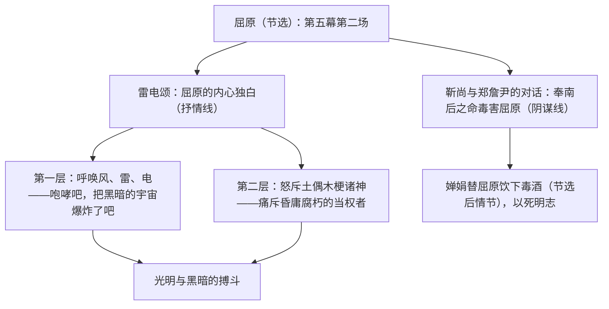

# 17 屈原（节选）

标签：#戏剧 #郭沫若 #历史剧

## 一、文学常识

- 作者：郭沫若（1892—1978），原名郭开贞，四川乐山人，作家、诗人、历史学家，代表作诗集《女神》、历史剧《屈原》《棠棣之花》《虎符》。
- 背景：《屈原》创作于 1942 年，正值抗日战争相持阶段、"皖南事变"之后；作者借战国时屈原的悲剧，抨击国民党当局的黑暗统治，"借古讽今，古为今用"。
- 文体：历史剧（话剧）。课文节选自第五幕第二场，核心是屈原的内心独白"雷电颂"。
- 屈原：战国末期楚国诗人、政治家，主张联齐抗秦，被谗流放，作《离骚》，投汨罗江而死。

## 二、字词积累

- **睥睨**（pì nì）：眼睛斜着看，形容高傲的样子。
- **咆哮**（páo xiào）：（猛兽）怒吼；形容水流奔腾轰鸣或人暴怒喊叫。
- **鞭挞**（tà）：鞭打，比喻抨击。
- **虐待**（nüè）：用残暴狠毒的手段对待。
- **雷霆**（tíng）：雷暴，霹雳。
- **踌躇**（chóu chú）：犹豫。
- **忏悔**（chàn）：认识了过去的错误而感到痛心。
- **伫立**（zhù）：长时间地站立。**污秽**（huì）：肮脏的东西。

## 三、结构层次

## 四、段落赏析

1. "风！你咆哮吧！咆哮吧！尽力地咆哮吧！"：呼告、反复、拟人连用，直接与自然力对话，气势磅礴，喷薄出变革现实的急切渴望。
2. "你们风，你们雷，你们电……都是诗，都是音乐，都是跳舞"：把毁灭性的自然力赞为诗与音乐，风雷电象征扫荡黑暗的变革力量。
3. 怒斥"土偶木梗"的东皇太一、湘君湘夫人等诸神：象征昏庸无能、欺民惑众的腐朽统治集团，指桑骂槐，锋芒毕露。
4. 舞台说明"午夜已经过去，黎明尚未到来……雷电交加"：典型环境设置，暗示黑暗至极而光明将至的时代氛围。

## 五、主题思想

节选通过屈原的"雷电颂"，塑造了一个热爱祖国、痛恨黑暗、渴望光明、坚贞不屈的爱国诗人形象，借古讽今，表达了抗战时期人民反抗国民党黑暗统治、追求自由光明的呐喊。

## 六、写作特色

1. 内心独白式抒情：大段独白使全场成为一首激越的散文诗；
2. 象征体系完整：风雷电象征变革力量，土偶木梗象征腐朽势力，洞庭湖长江东海象征人民；
3. 拟人、呼告、排比、反复叠用，情感如江河决堤；
4. 舞台说明烘托气氛，人物语言高度诗化。

## 七、练习题

1. "雷电颂"中风、雷、电象征什么？土偶木梗象征什么？
2. 赏析"把这黑暗的宇宙，阴惨的宇宙，爆炸了吧"的表达效果。
3. 结合创作背景，说明本剧"借古讽今"体现在哪里。
4. 独白在戏剧中有什么作用？

## 八、知识联系

- 与[[18 天下第一楼（节选）]][[19 枣儿]]同属戏剧单元，比较历史剧与现实题材话剧；
- 象征手法与[[4 海燕]]一脉相通，可对照复习；
- 排演本剧片段可结合[[任务二 准备与排练]]；
- 屈原的人格与[[9 鱼我所欲也]]"舍生取义"精神呼应。
