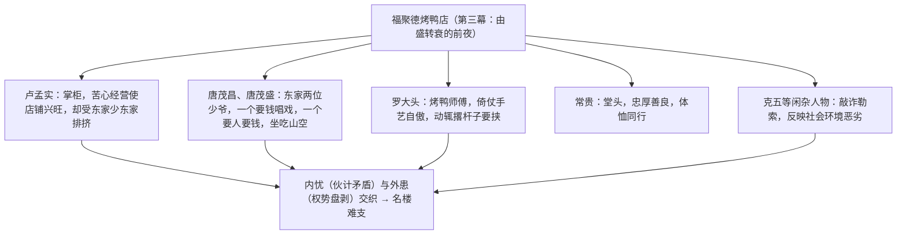

# 18 天下第一楼（节选）

标签：#戏剧 #话剧 #京味文学

## 一、文学常识

- 作者：何冀平，当代剧作家，北京人民艺术剧院编剧，后居香港，另有《新龙门客栈》等影视作品。
- 作品：《天下第一楼》创作于 1988 年，是北京人艺的经典保留剧目，写清末民初北京"福聚德"烤鸭店的兴衰，被誉为继《茶馆》之后京味话剧的又一高峰。
- 文体：话剧。课文节选自第三幕，写福聚德由盛转衰之际各方矛盾的集中爆发。

## 二、字词积累

- **鼎盛**：正当兴盛或强壮。
- **侦缉**（jī）：侦查缉捕。
- **怯懦**（qiè nuò）：胆小怕事。
- **忌讳**（huì）：因风俗习惯或畏惧权势而对某些言行有所顾忌。
- **拾掇**（duo）：整理，收拾。
- **幌子**（huǎng）：店铺门外表明所卖商品的标志，喻进行某种活动时的名义。
- **雕梁画栋**：指房屋华丽的彩绘装饰。
- **咬牙跺脚**：形容气愤到极点。
- **另请高明**：另外聘请更高明的人（辞职时的托词）。

## 三、情节与人物关系

## 四、语句与人物赏析

1. 唐茂昌开口便要支钱、要带走名厨：寥寥数语写活了坐享其成、挥霍祖业的纨绔子弟。
2. 罗大头"要不吃这一口，早晚得叫你们气死"：恃技傲物、火爆偏狭又有几分可怜，个性化台词鲜明。
3. 卢孟实斥责伙计又体恤常贵、赏钱给小伙计：恩威并施，精明干练而重情义，是旧时代有抱负却难逃悲剧的经营者形象。
4. 结尾修鼎新的对联"好一座危楼，谁是主人谁是客；只三间老屋，时宜明月时宜风"：暗示福聚德根基之"危"，点出"名楼兴衰不由勤劳者做主"的主题，意味深长。

## 五、主题思想

节选通过福聚德鼎盛背后的重重危机，展现了各色人物的生存状态与利益冲突，揭示旧时代"一个人干，八个人拆"的社会痼疾——勤劳者不能主宰自己命运的悲剧，寄寓对世态人情的深刻洞察。

## 六、写作特色

1. 京味语言：台词地道纯熟，富有北京口语的韵味与行业色彩；
2. 人物繁而不乱，三言两语即勾勒出性格；
3. 矛盾冲突集中：多条线索（要钱、要人、敲诈、撂杆子）在一幕中交汇；
4. 以小见大：一座酒楼折射社会变迁，与《茶馆》手法相承。

## 七、练习题

1. 节选部分写了福聚德面临的哪几重危机？
2. 结合台词分析卢孟实的形象。
3. 品味结尾对联的含义及其在剧中的作用。
4. 举例说明本剧语言的"京味"特色。

## 八、知识联系

- 与[[17 屈原（节选）]][[19 枣儿]]同属戏剧单元，本剧长于群像与冲突，可比较独白式与对话式戏剧；
- 以小场景写大时代的手法可联系[[5 孔乙己]]的咸亨酒店；
- 排演片段时的角色分析见[[任务二 准备与排练]]；
- 演出后的评议方法见[[任务三 演出与评议]]。
