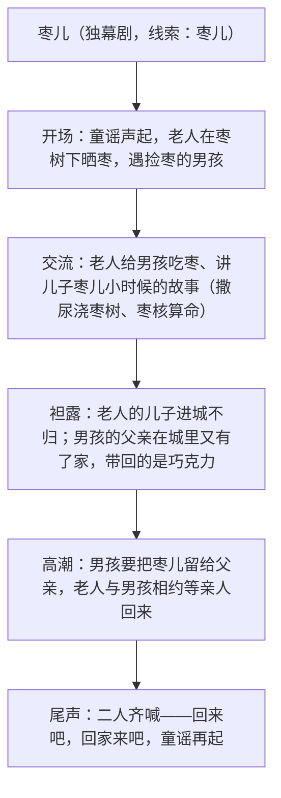

# 19 枣儿

标签：#戏剧 #话剧小品 #象征

## 一、文学常识

- 作者：孙鸿，当代剧作家。《枣儿》发表于 1999 年，曾获"1999 中国曹禺戏剧奖·小品小戏奖"一等奖。
- 背景：20 世纪 90 年代改革开放深入，大量农村人口进城，出现空巢老人与留守儿童，剧作敏锐捕捉这一社会变迁中的情感困境。
- 文体：话剧小品（独幕剧），全剧一景二人（老人与男孩），以"枣儿"为线索。

## 二、字词积累

- **蓦然**（mò）：猛然，不经心地。
- **翘首**（qiáo）：抬起头来（望）。
- **踌躇**（chóu chú）：犹豫不决。
- **咀嚼**（jǔ jué）：用牙齿磨碎食物；比喻对事物反复体会。
- **囫囵吞枣**（hú lún）：把枣整个吞下去，比喻读书等不加分析地笼统接受。
- **喃喃自语**：连续不断地小声跟自己说话。
- **心事重重**：心里挂着很多沉重的顾虑。

## 三、情节结构

## 四、语句赏析

1. 开场童谣"枣儿甜，枣儿香，要吃枣儿喊爹娘"：以民间童谣开篇结尾，首尾呼应，营造浓郁乡土氛围，暗含"呼唤亲情"的主题。
2. 老人讲"枣儿"名字的由来与儿时趣事：如数家珍的回忆愈温馨，眼下的孤独愈显凄凉，乐与哀相衬。
3. 男孩"爹回来会带巧克力"：巧克力与枣儿对举——现代都市生活与传统乡土生活的象征性对照。
4. "枣儿"的双重含义：既是具体的红枣、老人儿子的乳名，更象征亲情、故乡与传统生活，是全剧凝聚情感的核心意象。

## 五、主题思想

剧本通过老人与男孩围绕"枣儿"的对话，表现了社会转型期空巢老人对儿子、留守孩子对父亲的深切思念，反映了现代化进程中传统乡土情感面临的失落，发出了呼唤亲情、呼唤回归精神家园的深情吁请。

## 六、写作特色

1. 线索集中：一颗"枣儿"串起全部情节与情感；
2. 象征手法：枣儿、巧克力、童谣皆有象征意味，戏味淡而诗味浓；
3. 人物设置精简（一老一少），对话质朴而含蓄深沉；
4. 首尾童谣呼应，余韵悠长，留白耐人寻味。

## 七、练习题

1. "枣儿"在剧中有哪几层含义？
2. 剧本首尾的童谣有什么作用？
3. 老人与男孩各自的期盼说明了怎样的社会现象？
4. 比较"枣儿"与"巧克力"的象征意义。

## 八、知识联系

- 与[[17 屈原（节选）]][[18 天下第一楼（节选）]]构成戏剧单元三课，象征、线索、对话各有侧重；
- 象征意象的解读方法可回溯[[4 海燕]]与[[15* 无言之美]]的留白理论；
- 本剧人物少、场景单一，适合班级排演，衔接[[任务二 准备与排练]]；
- 亲情主题的写作可结合[[写作：审题立意]]训练。
