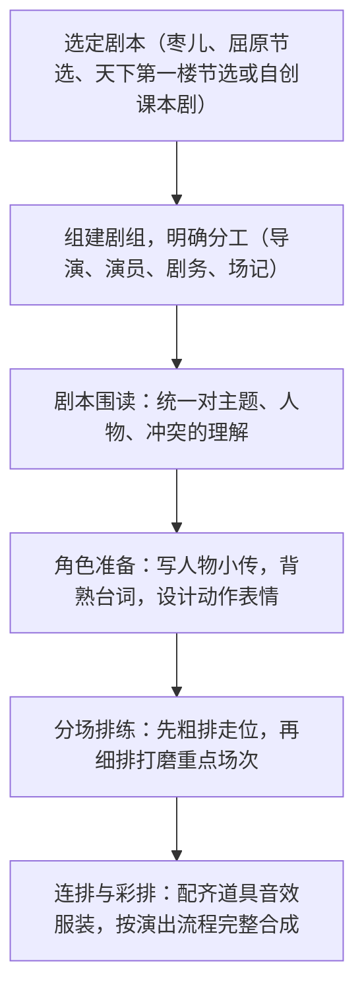

# 任务二 准备与排练

标签：#活动探究 #戏剧排演 #实践

## 一、任务概述

本任务是九年级下册第五单元"活动·探究"的第二环节：在阅读剧本（任务一）的基础上，组建剧组，完成从剧本研读到正式排练的全部准备工作，为任务三的演出打下基础。

## 二、技法要点

1. **组建剧组**：确定导演、演员、剧务（服装、道具、音效、灯光、化妆）、场记等分工，人人有事做。
2. **研读剧本**：全组通读，梳理戏剧冲突、情节脉络；导演阐释全剧基调，统一理解。
3. **分析人物**：为所演角色写"人物小传"——身份、经历、性格、语言特点、与他人关系，找准人物的"最高任务"。
4. **台词功夫**：读准字音，把握重音、停顿、语气、语速；潜台词要读出言外之意。
5. **舞台调度**：依据舞台说明设计上下场、走位、动作；道具布景求简而传神。

## 三、步骤方法

- 排练日程要倒排时间表，先难后易；
- 场记记录每次排练的问题清单，下次针对性解决；
- 导演须兼顾整体节奏：高潮场次要"慢工细磨"。

## 四、常见问题

1. 分工不清，只重演员轻剧务，演出保障脱节；
2. 背台词而不解其意，念白平淡缺乏潜台词；
3. 动作、走位随意，互相遮挡，背对观众；
4. 排练缺乏计划，前松后紧，彩排仓促；
5. 对舞台说明视而不见，丢失剧本规定情境。

## 五、实践练习

1. 为《枣儿》中的老人写一份 200 字人物小传，标注三处重点台词的语气处理。
2. 选《屈原（节选）》"雷电颂"一段，设计朗诵的重音与停顿并试演。
3. 小组为《天下第一楼（节选）》设计一张道具与布景清单。
4. 制定本组两周排练计划表，明确每次排练的目标与负责人。

## 六、知识联系

- 剧本研读基础见[[17 屈原（节选）]][[18 天下第一楼（节选）]][[19 枣儿]]三课；
- 排练成果将在[[任务三 演出与评议]]中检验；
- 人物小传的写作可运用[[写作：审题立意]]与人物分析方法；
- 台词的锤炼可参考[[写作：修改润色]]。
