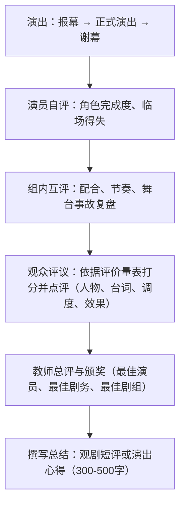

# 任务三 演出与评议

标签：#活动探究 #戏剧演出 #评议

## 一、任务概述

本任务是第五单元"活动·探究"的收官环节：正式演出排练成果，并组织观演双方进行评议总结，实现"以演促读、以评促思"的单元目标。

## 二、技法要点

### 演出环节

1. **演前准备**：检查服装道具音效，候场安静有序；设计报幕词，介绍剧目与剧组。
2. **舞台礼仪**：演员不背台、不挡人、不笑场；忘词时靠即兴接话补救，不中断演出。
3. **观演礼仪**：观众按时入场、关闭手机、适时鼓掌，做文明观众并做观剧笔记。

### 评议环节

1. **评议维度**：剧本理解是否准确、人物塑造是否鲜明、台词是否清晰有感染力、舞台配合是否默契、整体效果如何。
2. **评议原则**：先肯定亮点再指出不足，对事不对人，建议具体可操作。
3. **多元主体**：演员自评、剧组互评、观众点评、教师总评相结合。

## 三、步骤方法

## 四、常见问题

1. 只演不评，或评议流于"都挺好"的客套；
2. 点评空泛，无具体台词、动作实例支撑；
3. 观剧笔记缺失，评议凭模糊印象；
4. 把评议变成互相指责，伤了合作氛围；
5. 缺少书面总结，活动成果未沉淀为写作素材。

## 五、实践练习

1. 设计一张戏剧演出评价量表（含 5 个维度、分值与文字评语栏）。
2. 观看本班一组演出后，写一篇 400 字观剧短评，须引用具体台词或场面。
3. 以演员身份写一段演出心得：我如何理解并塑造这个角色。
4. 全班讨论：如果重演一次，你所在剧组最该改进的三件事。

## 六、知识联系

- 本任务承接[[任务二 准备与排练]]，是单元活动链的最后一环；
- 评议所依据的剧本理解可回溯[[17 屈原（节选）]][[18 天下第一楼（节选）]][[19 枣儿]]；
- 观剧短评是简短的议论文，可运用[[13 短文两篇（谈读书 不求甚解）]]的论证方法；
- 演出心得的写作可结合[[综合性学习：岁月如歌——我们的初中生活]]留存毕业记忆。
