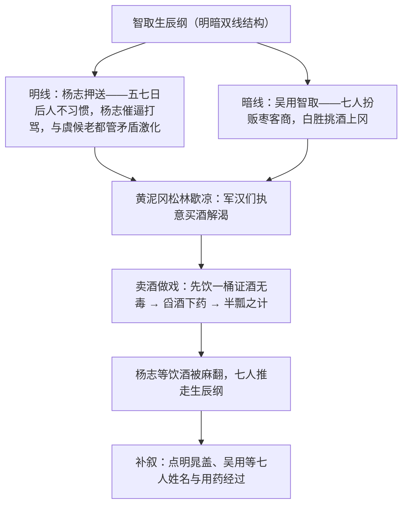

# 20 智取生辰纲

标签：#小说 #水浒传 #施耐庵

## 一、文学常识

- 作者：施耐庵，元末明初小说家。《水浒传》是我国第一部以农民起义为题材的长篇章回体白话小说，写北宋末年以宋江为首的一百单八将聚义梁山的故事。
- 选文：节选自《水浒传》第十六回"杨志押送金银担，吴用智取生辰纲"。生辰纲：为庆贺生辰而成批运送的财物（梁中书送给岳父蔡京的十万贯寿礼）。
- 文体：古典白话小说。

## 二、字词积累

- **趱行**（zǎn）：赶路。**嗔**（chēn）：怒，生气。
- **虞候**（yú hòu）：官名，文中指随行办事的差人。
- **恁地**（nèn）：这样，如此。**怄**（òu）：故意惹人恼怒。
- **兀的**（wù dì）：怎么，表反问。**喏喏连声**（nuò）：恭敬地连连答应。
- **芥菜**（jiè）：一种蔬菜。**忍气吞声**：受了气勉强忍耐，不说什么话。
- **面面厮觑**（qù）：互相望着发愣。
- **计较**：计策（古今异义）。**端的**：真的，确实。

## 三、情节结构（明暗双线）

## 四、段落赏析

1. 天热描写贯穿全文（"红日当天，没半点云彩"）：烈日酷暑既是自然环境，更是推动情节的关键——热才要歇凉、才要买酒，是"智取"得逞的客观条件。
2. 杨志"轻则痛骂，重则藤条便打"：谨慎精明却急功近利、粗暴驭下，导致内部离心，其"智"败于失了人和。
3. 吴用之"智"：智用天时（酷热正午）、智用地利（黄泥冈松林、十五里无人烟）、智用矛盾（杨志与军汉离心）、智用计谋（半瓢酒下药，瞒天过海）。
4. 结尾补叙手法：谜底最后揭开，回视前文处处伏笔（吹嘘假意不卖、饶酒舀酒），构思精巧，悬念十足。

## 五、主题思想

课文通过杨志押送与晁盖吴用等人智取生辰纲的斗智过程，展现了"智"的较量，歌颂了起义英雄的智慧与团结，也揭示了封建统治阶级搜刮民财（不义之财）激起反抗的社会现实。

## 六、写作特色

1. 明暗双线交织，结尾补叙揭底，悬念迭起；
2. 环境描写（酷热）服务于情节与人物；
3. 对比：杨志集团内部离心 vs 晁盖七人齐心协力；
4. 人物语言动作个性化，白话生动传神。

## 七、练习题

1. 杨志失败的原因有哪些（主观与客观）？
2. 吴用等人的"智"体现在哪几个方面？
3. 文中的自然环境描写有什么作用？
4. 补叙的运用有什么妙处？

## 八、知识联系

- 整本书阅读见[[名著导读：《水浒传》]]，杨志"失意—得志—幻灭"的线索须整体把握；
- 与[[21 范进中举]][[22* 三顾茅庐]][[23* 刘姥姥进大观园]]同属古典小说单元，比较四大名著笔法；
- 环境推动情节的手法可联系[[7* 溜索]]；
- 双线结构可借鉴于[[写作：布局谋篇]]。
