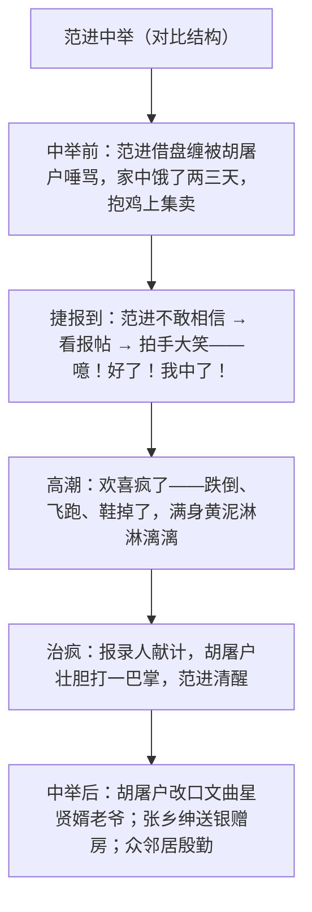

# 21 范进中举

标签：#小说 #儒林外史 #讽刺

## 一、文学常识

- 作者：吴敬梓（1701—1754），字敏轩，号粒民，清代小说家，著有《儒林外史》——我国古代讽刺小说的高峰。
- 选文：节选自《儒林外史》第三回"周学道校士拔真才，胡屠户行凶闹捷报"。
- 背景：明清科举以八股取士，读书人把中举视为改变命运的唯一出路，痴迷终生。
- 文体：古典白话小说（讽刺小说）。

## 二、字词积累

- **作揖**（yī）：拱手行礼。**带挈**（qiè）：提携。
- **见教**：指教（我）（谦辞）。**腆着**（tiǎn）：挺着。
- **啐**（cuì）：唾，从嘴里吐出来。**星宿**（xiù）：星的位次，文中指文曲星。
- **避讳**（huì）：不愿说出或听到某些会引起不愉快的字眼。
- **商酌**（zhuó）：商量斟酌。**桑梓**（zǐ）：家乡。
- **万贯家私**：大量的家财。**不省人事**（xǐng）：昏迷，失去知觉。
- **狗血喷头**：形容骂得很凶。**唯唯连声**：连连答应。

## 三、情节结构

## 四、人物与细节赏析

1. 范进"拍手大笑""噫！好了！我中了！"：几十年热望骤然实现，喜极而疯——夸张而真实，是科举毒害读书人灵魂的集中爆发；"好了"二字道尽一生辛酸。
2. 胡屠户前倨后恭："现世宝""癞蛤蟆"变为"才学又高，品貌又好"的"文曲星"；打完巴掌后"那只手隐隐的疼……再也弯不过来"，讽刺其前后自打嘴巴。
3. "屠户见女婿衣裳后襟滚皱了许多，一路低着头替他扯了几十回"：细节传神，谄媚之态跃然纸上。
4. 张乡绅"世先生同在桑梓，一向有失亲近"：素不相识却攀附送银赠房，揭示官绅结党营私的社会关系网。

## 五、主题思想

课文通过范进中举喜极而疯及其前后众人态度的巨变，深刻揭露了科举制度对读书人心灵的毒害，批判了封建社会趋炎附势、嫌贫爱富的世态炎凉。

## 六、写作特色

1. 强烈对比：范进中举前后境遇、胡屠户前后言行、众邻居冷热；
2. 夸张讽刺：喜疯的过程层次分明（昏厥—疯跑—跌塘）；
3. 细节描写（扯衣襟、手弯不过来）以小见大；
4. 侧面烘托：借众人反应写科举的社会影响。

## 七、练习题

1. 范进发疯的过程可分为哪几个层次？
2. 对比胡屠户在范进中举前后的语言，分析其性格。
3. 张乡绅的到访有什么深意？
4. 本文与《孔乙己》都写科举牺牲品，讽刺手法有何异同？

## 八、知识联系

- 整本书阅读见[[名著导读：《儒林外史》]]，周进、严监生等人物可对照；
- 与[[5 孔乙己]]构成"中举者"与"落第者"的双面镜像，是中考比较阅读热点；
- 与[[20 智取生辰纲]][[23* 刘姥姥进大观园]]同单元，比较讽刺小说与世情小说笔法；
- 对比手法可迁移至[[写作：有创意地表达]]。
