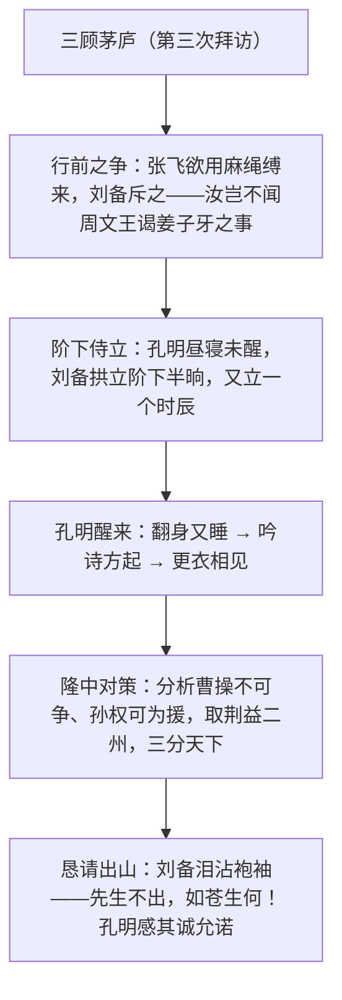

# 22* 三顾茅庐

标签：#小说 #三国演义 #罗贯中

## 一、文学常识

- 作者：罗贯中，名本，字贯中，号湖海散人，元末明初小说家。《三国演义》是我国第一部长篇章回体历史演义小说，以魏蜀吴三国纷争为题材，"七分实事，三分虚构"。
- 选文：节选自《三国演义》第三十八回"定三分隆中决策，战长江孙氏报仇"，写刘备第三次拜访诸葛亮。
- 背景：官渡之战后刘备依附刘表屯兵新野，经徐庶（元直）举荐，三次亲赴隆中拜请诸葛亮出山。

## 二、字词积累

- **拜谒**（yè）：拜见。**失礼**：违背礼节。
- **傲慢**：轻视别人，对人没有礼貌。**疏懒**：懒散而不习惯于受拘束。
- **愧赧**（nǎn）：因羞惭而脸红。**鄙贱**：指卑微下贱的人（谦辞）。
- **存恤**（xù）：爱惜，体恤。**如雷贯耳**：像雷声穿过耳朵，形容名声很大。
- **经世奇才**：治理天下的杰出才能。**思贤如渴**：比喻迫切地想延揽人才。
- **箪食壶浆**（dān sì hú jiāng）：用箪盛饭，用壶盛浆，形容百姓欢迎军队。
- **顿开茅塞**（sè）：原来心里像被茅草堵塞，忽然开通了，形容忽然理解领会。

## 三、情节结构

## 四、人物与段落赏析

1. 刘备斥责张飞、下马步行、拱立阶下等候数时辰：一系列言行写尽求贤若渴、礼贤下士的诚意，"诚"字贯穿全篇。
2. 张飞"等我去屋后放一把火，看他起不起"：莽撞急躁的性格与刘备的谦恭形成鲜明对比，反衬刘备之诚。
3. 诸葛亮高卧吟诗"大梦谁先觉？平生我自知"：未见其人先闻其声，写出隐士的高逸与自负，也是对刘备诚意的最后试探。
4. 隆中对策寥寥数语"先取荆州为家，后即取西川建基业，以成鼎足之势"：未出茅庐而知三分天下，凸显诸葛亮经天纬地之才。

## 五、主题思想

课文通过刘备三顾茅庐的经过，赞美了刘备求贤若渴、礼贤下士的胸怀与诸葛亮的旷世奇才，揭示了"人才是成就大业之本"的道理，"三顾茅庐"也由此成为诚心求才的代名词。

## 六、写作特色

1. 铺垫与悬念：两次不遇（前文）蓄势，第三次层层设阻（昼寝、翻身又睡），千呼万唤始出来；
2. 对比映衬：张飞之莽衬刘备之诚，孔明之淡衬其才之奇；
3. 语言、动作描写传神，人物性格鲜明；
4. 侧面描写与正面描写结合塑造诸葛亮形象。

## 七、练习题

1. 课文从哪些细节表现刘备的"诚"？
2. 张飞在文中起什么作用？
3. "隆中对策"的主要内容是什么？表现了诸葛亮怎样的才能？
4. 积累与诸葛亮有关的成语、俗语各两个。

## 八、知识联系

- 与[[20 智取生辰纲]][[21 范进中举]][[23* 刘姥姥进大观园]]同属古典小说单元，可比较历史演义与世情小说；
- 求贤主题可与[[11 送东阳马生序]]尊师重道的态度互相印证；
- 铺垫悬念的技法可用于[[写作：布局谋篇]]；
- 人物对比塑造法可迁移到[[写作：有创意地表达]]。
