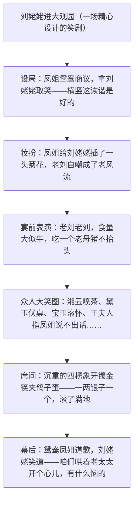

# 23* 刘姥姥进大观园

标签：#小说 #红楼梦 #曹雪芹

## 一、文学常识

- 作者：曹雪芹（约 1715—约 1763），名霑，字梦阮，号雪芹，清代小说家。《红楼梦》又名《石头记》，是我国古代小说的巅峰之作，前八十回为曹雪芹作，后四十回一般认为高鹗（一说无名氏）续。
- 选文：节选自《红楼梦》第四十回"史太君两宴大观园，金鸳鸯三宣牙牌令"，写刘姥姥二进荣国府、游大观园时的一场"笑剧"。
- 刘姥姥：与贾府王夫人家连宗的乡下老妪，一进荣国府求助，二进带瓜果答谢，三进救巧姐，是贯穿贾府兴衰的线索人物之一。

## 二、字词积累

- **蓼溆**（liǎo xù）：生有蓼草的水边。
- **潇湘馆**：林黛玉在大观园的住所。
- **秋爽斋**：贾探春的住所。**篾片**（miè）：旧时称帮闲清客。
- **调停**（tiáo）：安排处理。**发怔**（zhèng）：发呆。
- **岔气**：呼吸时两肋觉得不舒服或疼痛。
- **促狭**（cù xiá）：爱捉弄人。**筵席**（yán）：酒席。
- **麈尾**（zhǔ）注意积累；**撮弄**（cuō）：戏弄。

## 三、情节结构

## 四、人物与段落赏析

1. 刘姥姥"老刘，老刘，食量大似牛"的自嘲表演：她并非真愚，而是洞悉一切、甘当"篾片"逗贾母开心——朴实狡黠、豁达世故的乡村老人形象。
2. "众人笑态"的群像描写：湘云撑不住喷茶、黛玉笑岔气伏桌、宝玉滚到贾母怀里、惜春拉着奶母揉肠子——一人一态，笔笔各异，映照各自身份性格，是白描群像的经典段落。
3. 凤姐、鸳鸯的"促狭"：精于逢迎设计取笑，反映贾府逸乐生活与主仆间微妙关系。
4. 以刘姥姥的乡野眼光看大观园的奢华（一两银子一个的鸽子蛋）：城乡对照、贫富对照，为贾府盛极而衰埋下讽喻。

## 五、主题思想

课文借刘姥姥游园的笑剧，用乡村老妪的视角映照贾府生活的奢靡精致，展现了刘姥姥朴素精明、隐忍豁达的性格，也在笑声中暗含对贵族之家浮华的冷静审视。

## 六、写作特色

1. 视角独特：以局外人刘姥姥的眼光写大观园，陌生化效果鲜明；
2. 群像描写各具情态，符合人物身份性格；
3. 语言雅俗交融：刘姥姥的村言俚语与贾府的雅致谈吐相映成趣；
4. 笑中有泪、乐中含悲的复调意味。

## 七、练习题

1. 这场"笑剧"是谁导演的？刘姥姥是否真的可笑？谈谈你的看法。
2. 分析"众人笑态"描写如何做到符合人物身份性格。
3. 从刘姥姥的言行看她的性格特点。
4. 作者安排刘姥姥进大观园有什么深层用意？

## 八、知识联系

- 与[[20 智取生辰纲]][[21 范进中举]][[22* 三顾茅庐]]共同构成古典小说单元，四大名著风格可列表比较；
- 群像笑态描写与[[5 孔乙己]]中"众人的笑"内涵不同，可作比较阅读；
- 独特视角的选择可启发[[写作：有创意地表达]]；
- 世情小说的讽喻笔法可联系[[名著导读：《儒林外史》]]。
